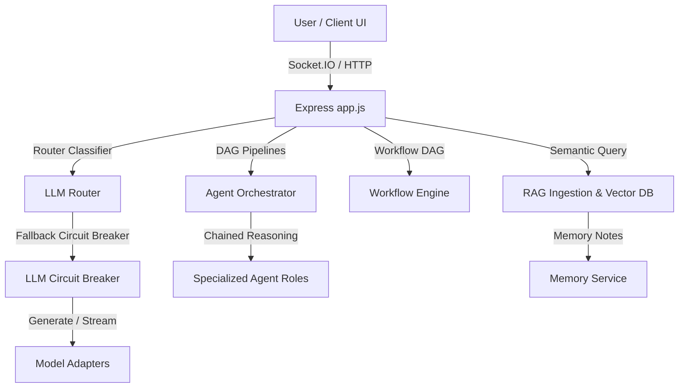

# 🛡️ ATHX API Security Scanner Platform

Welcome to the **ATHX API Security Scanner** platform documentation. This reference runs through the core system architecture, directory layouts, and operations runbooks.

---

## 1. System Architecture



### 1.1 Core Subsystems
1.  **Modular LLM Adapter Layer:** Abstract [BaseAdapter](file:///c:/Users/athar/api-security-scanner/backend/src/modules/llm/base.adapter.js) contract executing keyless Pollinations API calls, local LLMs (Ollama, LM Studio), and commercial adapters (OpenAI, Claude, Gemini, Groq, DeepSeek).
2.  **API Funnel Router & Circuit Breaker:** Dynamically maps queries to preferred categories (`coding`, `reasoning`, `general`), tracks rolling latencies, and drops unconfigured/failing providers.
3.  **Multi-Agent Orchestrator System:** Coordinates specialized security, code auditing, and compliance agents using topological DAG task execution graphs with Socket.IO collaboration telemetry.
4.  **Semantic RAG & Memory Service:** Indexes security scan structures, OpenAPI specifications, and chat preferences to dynamically inject context citations into prompts.

---

## 2. Operations Runbook

### 2.1 Adding a New Model Provider Adapter
To register a new adapter (e.g. `anthropic`):
1.  Create `backend/src/modules/llm/adapters/anthropic.adapter.js` inheriting from `BaseAdapter`.
2.  Register the constructor instance in `backend/src/modules/llm/llm.registry.js`.
3.  Add the credential validation check to `LLMRegistry.isProviderConfigured` and include it in the default fallback lists.

### 2.2 Constructing custom automation workflows
Workflows are built by registering topological task lists with target dependencies.
**Example Creation Payload (`POST /api/workflows`):**
```json
{
  "name": "Production Audit and Notify Flow",
  "steps": [
    {
      "id": "run-scanner",
      "stepType": "scan",
      "config": { "targetUrl": "https://api.endpoint.com" },
      "dependsOn": []
    },
    {
      "id": "slack-alert",
      "stepType": "notify",
      "config": { "channel": "slack" },
      "dependsOn": ["run-scanner"]
    }
  ]
}
```

### 2.3 Debugging AI Router Pipelines
*   Check the metrics dashboard logs to review rolling request/failure statistics.
*   Run the dynamic fallback chaos testing script: `node src/modules/llm/consensus/runChaosTest.js` to verify circuit breaker health trips.
*   Execute the benchmark suite: `node src/modules/llm/consensus/runBenchmark.js` to ensure zero prompt injection regressions.

---
**End of Operations Reference**
