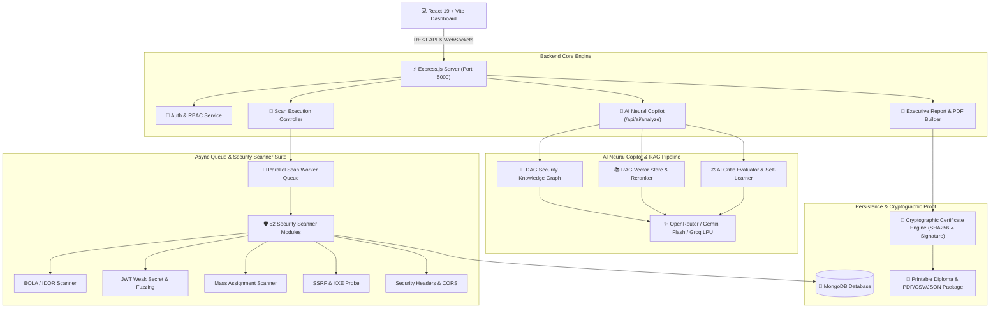
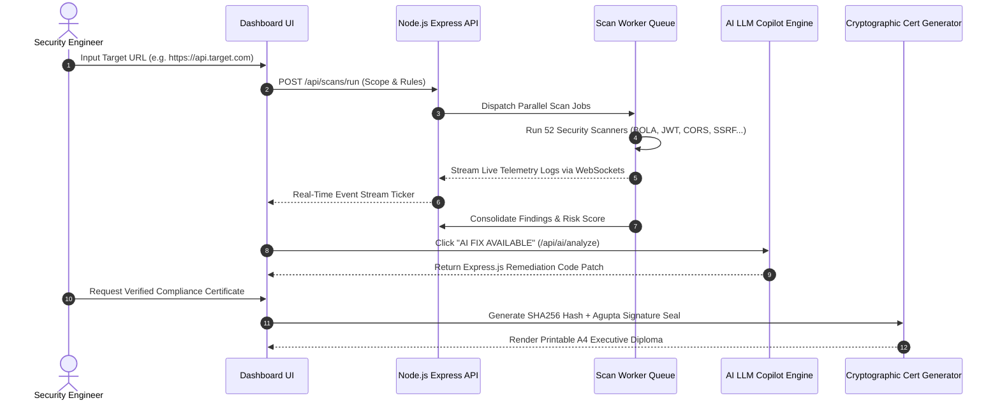

# 🛡️ API Security Scanner — Enterprise AI Autonomous Security Platform (v3.0)

<div align="center">


[](https://react.dev/)
[](https://vite.dev/)
[](https://nodejs.org/)
[](https://www.mongodb.com/)
[](https://bullmq.io/)
[](https://openrouter.ai/)

**An autonomous API vulnerability assessment platform, multi-agent AI remediation engine, multi-framework compliance radar, and executive cryptographic audit proof generator.**

</div>

---

## 📐 System Architecture Diagram

The system employs a decoupled high-concurrency architecture comprising active DAST crawlers, 52 security scanners running in parallel worker queues, a DAG Knowledge Graph + RAG Copilot Engine, and a Cryptographic Audit Certificate Generator.



---

## ⚡ Autonomous Scanning & Remediation Flow



---

## 🌟 Complete Feature Inventory

### 🛡️ 1. 52 Specialized Security Scanner Modules
The platform embeds 52 specialized automated security scanners covering all major API threat vectors:

- **OWASP API Top 10 (2023 Categories)**:
  - `bola-idor.scanner.js`: Broken Object-Level Authorization & IDOR probe.
  - `bfla.scanner.js`: Broken Function-Level Authorization scanner.
  - `mass-assignment.scanner.js`: Object property injection & mass assignment vulnerability probe.
  - `jwt-weak-secret.scanner.js`: JWT signature forgery, `none` algorithm, and dictionary secret cracker.
  - `rate-limiting.scanner.js`: Unrestricted resource consumption & rate limit bypass testing.
- **Injection & Server-Side Probes**:
  - `ssrf.scanner.js`: Server-Side Request Forgery & internal metadata endpoint probes.
  - `xxe.scanner.js`: XML External Entity injection testing.
  - `ssti.scanner.js`: Server-Side Template Injection.
  - `nosql-injection.scanner.js`: MongoDB / CouchDB operator injection.
  - `ldap-injection.scanner.js` & `xpath-injection.scanner.js`: Directory & XML query injection.
- **Infrastructure & Configuration Leakage**:
  - `cloud-metadata.scanner.js`: AWS / GCP / Azure IMDSv1/v2 metadata exposure.
  - `git-exposure.scanner.js` & `env-exposure.scanner.js`: `.git/config` & `.env` environment file leaks.
  - `redis-exposure.scanner.js` & `grpc-security.scanner.js`: Unauthenticated Redis & gRPC service exposure.
  - `swagger-exposure.scanner.js`: Exposed OpenAPI / Swagger documentation endpoints.
  - `cors-null-origin.scanner.js`: Misconfigured CORS with trusted null or wildcards.

---

### 🤖 2. AI Neural Copilot & Dynamic Remediation Engine
- **Dynamic Patch Synthesis**: `/api/ai/analyze` connects to OpenRouter, Google Gemini Flash, and Groq LPU to analyze raw HTTP request/response vectors and generate drop-in Express.js security fixes.
- **DAG Knowledge Graph**: Traverses OWASP categorizations, CWE taxonomies, and remediation patterns for context-aware recommendations.
- **AI Critic Evaluator**: Self-learning feedback pipeline that refines rule accuracy based on user validation.

---

### 📊 3. Multi-Framework Compliance Radar & Posture HUD
- Interactive Recharts compliance radar matrix evaluating target readiness across 4 international frameworks:
  - **OWASP API Top 10 (2023)**
  - **PCI-DSS v4.0**
  - **SOC 2 Type II**
  - **ISO 27001 / HIPAA**

---

### 📑 4. Executive Report Builder & Multi-Format Exports
- **3 Custom Report Presets**:
  - 🏛️ **Executive Board Deck**: High-level posture grades and executive summary.
  - 🛠️ **Dev Remediation Playbook**: Detailed HTTP payloads, code fixes, and cURL commands.
  - 📜 **Full Audit Package**: Complete breakdown of all controls and raw logs.
- **Supported Export Formats**: PDF Packages, CSV Registries, JSON Security Logs, OpenAPI 3.0 Specifications, and `.ZIP` Archives.

---

### 📜 5. Cryptographic Compliance Certificate & Digital Signature
- High-contrast gold/emerald Verified Security Certificate frame.
- **Cryptographic Validation**: SHA256 audit hashes and HMAC verification seals.
- **Transparent Signature Integration**: Embedded executive handwritten signature (`A. Gupta • Chief Security Officer`) using dark-mode CSS blend filtering (`invert(1) mix-blend-mode: screen`).
- **High-Resolution Print Output**: Instant 1-click printable A4 landscape diploma window.

---

## 🔮 Future Roadmap & Planned Upgrades

- [ ] **eBPF Kernel-Level Traffic Inspection**: Intercept zero-overhead kernel sockets for passive API discovery.
- [ ] **GitHub Actions & Kubernetes CI/CD Gate**: Automated PR blocker for CI/CD security pipeline enforcement.
- [ ] **Dynamic OAuth2 / OIDC Fuzzer**: Automated PKCE, state parameter, and token replay vulnerability probes.
- [ ] **Multi-Tenant Enterprise Organizations**: Advanced RBAC with SAML 2.0 / Okta SSO integration.

---

## 🛠️ Local Development & Setup Guide

Follow this step-by-step guide to get the platform running locally on Windows, macOS, or Linux.

### 📋 Prerequisites
- **Node.js**: v18.0+ (v20+ or v24+ recommended)
- **npm**: v9.0+
- **MongoDB**: Local MongoDB community server or MongoDB Atlas URI
- **Git**: Installed on your system

---

### 📥 1. Clone the Repository
```bash
git clone https://github.com/Redkrossresearch/api-security-scanner.git
cd api-security-scanner
```

---

### ⚙️ 2. Backend Setup
1. Navigate to the backend directory:
   ```bash
   cd backend
   ```
2. Install backend dependencies:
   ```bash
   npm install
   ```
3. Create a `.env` configuration file in `backend/`:
   ```env
   PORT=5000
   NODE_ENV=development
   MONGODB_URI=mongodb://127.0.0.1:27017/api-security-scanner
   JWT_ACCESS_SECRET=your_super_secret_jwt_access_key_minimum_32_characters
   JWT_REFRESH_SECRET=your_super_secret_jwt_refresh_key_minimum_32_characters
   CLIENT_URL=http://localhost:5173
   
   # Optional: AI Copilot API Keys
   OPENROUTER_API_KEY=your_openrouter_api_key
   GROQ_API_KEY=your_groq_api_key
   GEMINI_API_KEY=your_gemini_api_key
   ```
4. Start the backend development server:
   ```bash
   npm run dev
   ```
   *The server will start on `http://localhost:5000`.*

---

### 🎨 3. Frontend Setup
1. Open a new terminal and navigate to the frontend directory:
   ```bash
   cd frontend
   ```
2. Install frontend dependencies:
   ```bash
   npm install
   ```
3. Start the Vite frontend development server:
   ```bash
   npm run dev
   ```
   *The client will start on `http://localhost:5173`.*

---

### 🧪 4. Running Production Build Verification
To ensure everything compiles cleanly for production:
```bash
cd frontend
npm run build
```

---

## 👥 Branching Strategy & Team Workflow

- **`atharv-dev`**: Primary backend security engine, AI copilot, scanner algorithms, and report services.
- **`muskan-dev`**: Frontend UI components, styling utilities, and dashboard table layouts.
- **`main`**: Production-ready releases.

---

## 📄 License
Distributed under the **MIT License**. See `LICENSE` for details.
