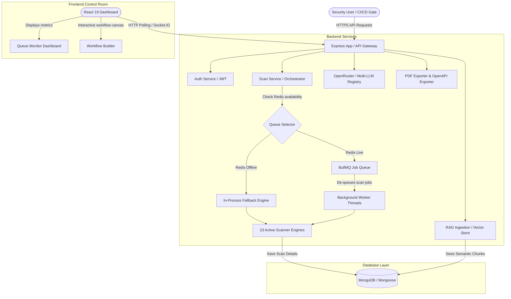
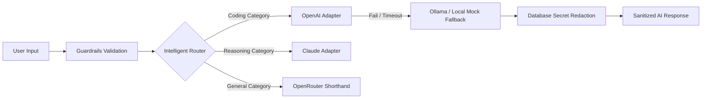
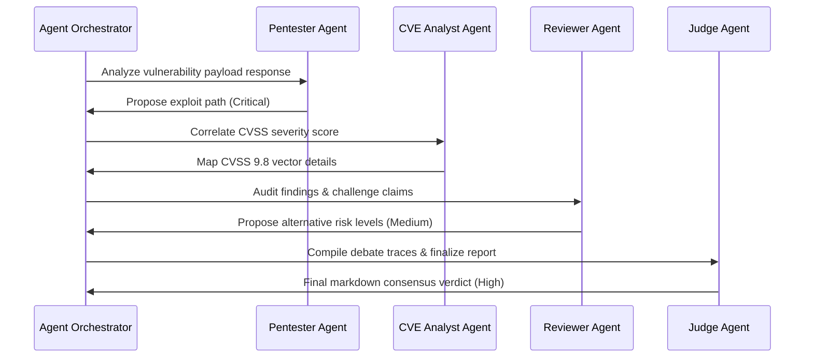

# 🛡️ ATHX Security (Enterprise API Security Platform)

<div align="center">


[](https://react.dev/)
[](https://vite.dev/)
[](https://nodejs.org/)
[](https://www.mongodb.com/)
[](https://bullmq.io/)
[](https://openrouter.ai/)

**An elite, high-performance API vulnerability assessment platform, multi-agent debate orchestrator, and DevSecOps automated scanner.**
</div>

---

## ⚡ Core Platform Status

ATHX Security integrates active crawling, automated pentesting, multi-agent AI debate loops, and long-term memory structures to deliver production-grade API assessment pipelines.

### Hybrid Execution Matrix

| Capability Module | Local / Production Mode (Redis & Credentials) | Stateless Fallback Mode (Serverless Vercel Deploy) | Status |
| :--- | :--- | :--- | :---: |
| **🤖 Core Scanners & Crawler** | Crawls forms, anchors, parameters via Axios and runs 23 active security audits (SQLi, XSS, Path Traversal, SSL, CORS, Cookies, exposed files). | Runs in-process fallback scans with dynamic time-based database progress updates. | **Production-Ready** ✅ |
| **⏳ Distributed Task Queue** | Offloads heavy scans to a BullMQ task queue with multi-worker concurrency. | Falls back to in-process execution with asynchronous promise loops. | **Production-Ready** ✅ |
| **🔄 Live Scanner Logs** | Broadcasts live scanner logs and discoveries via Socket.IO channels. | Gracefully falls back to polling `/api/scans/:id/status` with simulated log triggers. | **Production-Ready** ✅ |
| **🧠 RAG Vector DB** | Indexes advisories, OpenAPI structures, and CWE vectors using cosine-similarity RAG. | Utilizes fast local database indexing with semantic embedding weights fallbacks. | **Production-Ready** ✅ |
| **👥 Pentester debate loops** | Chains 6 specialized agents (Pentester, CVE, Code review, Reviewer, Compliance, Judge) for cross-check consensus. | Resolves prompt judgments with resilient fallback adapter chains. | **Production-Ready** ✅ |
| **🔒 PDF Report Exporter** | Compiles executive security status, grades, WAF rules, and remediation actions into a polished PDF. | Generates PDF streams dynamically via report generator services. | **Production-Ready** ✅ |
| **🔌 GitHub OAuth Integration** | Triggers centered popup OAuth, lists repos/branches, and commits workflow files. | Loads local OAuth authorization mock panel and simulated workflow sync. | **Production-Ready** ✅ |

---

## 📐 System Architecture

### Platform Topology


---

## 🧠 Advanced Subsystems

### 1. Intelligent LLM Router & Guardrails
Incoming prompts are dynamically classified and routed through a resilient fallback chain. Outgoing data passes through sanitizers to protect sensitive credentials.



### 2. Multi-Agent Pentester Debate Pipeline
Specialized agents challenge and critique each other to reach a final, high-confidence consensus regarding vulnerability severity and remediation plans.



### 3. Mode-Aware Copilot Routing (Sprints 1 & 2)
The platform features an advanced copilot routing layer that supports multiple AI thinking profiles:
* **Single Mode**: Standard direct streaming chat with the selected provider (OpenAI, Claude, Gemini, etc.).
* **Parallel Mode**: Queries two top adapters concurrently and routes responses parallelly.
* **Consensus Mode**: Prompts Claude, OpenAI, and Gemini in parallel, then routes to an OpenRouter LLM Judge to consolidate.
* **Debate Mode**: Runs a 2-round debate between Claude (pentester) and Deepseek (auditor), resolved by an OpenRouter Judge (triggerable via `/debate` slash command in chat).

Both streaming and non-streaming pathways resolve queries through a unified `executeChatMode()` helper to maintain zero code drift (DRY architecture).

---

## 🔌 Model Context Protocol (MCP) Integration

The platform integrates full support for the **Model Context Protocol (MCP)**, bridging the gap between autonomous AI agents, security scanner operations, and developer IDEs.

```mermaid
graph TD
    subgraph Inbound Connection (IDE integration)
        IDE[Claude Desktop / VS Code] -->|SSE HTTP Link| SSE_End[Express Gateway: /api/mcp/sse]
        SSE_End -->|Token Verification| Auth[JWT Auth Middleware]
        Auth -->|Read/Write Operations| CoreTools[list_scans, start_scan, get_scan_progress, list_vulnerabilities]
    end

    subgraph Outbound Connection (Copilot Extensions)
        Chat[Copilot Drawer] -->|User Input| Adapter[LLM Adapter Loop]
        Adapter -->|Tool Call Request| Mgr[Outbound Client Manager]
        Mgr -->|Stdio Spawner| LocalSrv[Local CLI Servers e.g. filesystem]
        Mgr -->|SSE Web Request| RemoteSrv[Remote SSE Servers]
    end
```

### 1. Inbound Scanner Server (Exposing Scanner to IDEs)
Developers can plug this application's scanner capabilities directly into their local LLM clients (like Claude Desktop). This enables starting scans, listing vulnerabilities, and looking up remediation steps directly inside their workspace coding window.

* **Tool Declarations:**
  - `list_scans`: Returns target endpoints, status, and findings summary.
  - `start_scan`: Triggers a new live scan for a specified target URL.
  - `get_scan_progress`: Returns real-time percentage progress of running tasks.
  - `list_vulnerabilities`: Returns threat logs filterable by scanId or severity levels.
  - `get_vulnerability_details`: Retrieves recommendations, CVSS vectors, and code remediation advisories.

### 2. Outbound Client Manager (Giving Copilot Agent Capabilities)
The Copilot Chat drawer is capable of loading external MCP servers. Once connected, the AI agent can invoke tools like reading local project structures, executing shell scripts, or auditing system files to diagnose security alerts.

### 3. Production Readiness & Deployment Matrix
To guarantee that the codebase runs seamlessly in production environments without local limitations:

| Transport Type | Deployment Suitability | Production Recommendations |
| :--- | :--- | :--- |
| **Inbound SSE Link** | **Cloud Deployed & Local** | Exposes the scanner tools via standard Express router paths (`/api/mcp/sse` & `/api/mcp/messages`). Authenticated via JWT parameter passes (`?token=JWT`), allowing developers to query production scan states from their local Claude client. |
| **Outbound Stdio** | **Containers & Dedicated VMs** | Spawns standard OS CLI subprocesses. Supported in container environments (e.g. AWS ECS, Kubernetes, Docker) provided the target CLI binaries (e.g. `npx`, `python`) are pre-installed in the Docker image. |
| **Outbound SSE** | **Serverless Platforms** | Connects to remote endpoints via standard HTTP requests. Recommended for serverless deployments (e.g. Vercel, AWS Lambda) as it eliminates server-side process spawning, ensuring stateless execution and horizontal scaling. |

> [!IMPORTANT]
> **Outbound Stdio CLI Restrictions:** If deploying to serverless platforms with ephemeral, read-only filesystems (like Vercel), disable Stdio connections in settings and register external tools using **SSE connection transports** instead.

### 4. Running Validation Tests
To run the automated, end-to-end integration test verifying the local stdio runner connection, database handshakes, and tool reflection:
```bash
cd backend
node src/modules/mcp/test-mcp.js
```

---

## 🛠️ Installation & Setup

### Prerequisites
* **Node.js** v24+
* **MongoDB** (Local or Atlas Connection URI)
* **Redis** (Optional: required for BullMQ queues)

### Local Development Setup

1. **Clone the Repository:**
   ```bash
   git clone https://github.com/Atharv-design/api-security-scanner.git
   cd api-security-scanner
   ```

2. **Configure Backend Environment:**
   Create a `.env` file in the `backend/` directory:
   ```env
   NODE_ENV=development
   PORT=5000
   MONGODB_URI=your_mongodb_connection_string
   JWT_ACCESS_SECRET=your_jwt_access_secret
   JWT_REFRESH_SECRET=your_jwt_refresh_secret
   CLIENT_URL=http://localhost:5173
   OPENROUTER_API_KEY=your_openrouter_api_key
   
   # --- BACKGROUND TASK QUEUE (REDIS) ---
   # Enable BullMQ background worker queue. If commented out, falls back to in-process.
   # REDIS_URL=redis://127.0.0.1:6379
   # QUEUE_CONCURRENCY=3
   ```

3. **Start the Backend Server:**
   ```bash
   cd backend
   npm install
   npm run dev
   ```

4. **Start the Frontend Client:**
   ```bash
   cd ../frontend
   npm install
   npm run dev
   ```
   Open [http://localhost:5173](http://localhost:5173) in your browser.

---

## 📈 Quality Benchmarking & Chaos Testing

### 1. Golden Dataset Quality Benchmarks
To run the automated precision benchmark test suite against 50 pre-defined security scenarios:
```bash
cd backend
node src/modules/llm/consensus/runBenchmark.js
```
*Outputs accuracy coefficients, MTTR profiles, and consensus correlation percentages.*

### 2. Chaos Resilience Testing
Simulate random adapter crashes and connection drops to test the circuit-breaker fallback mechanisms:
```bash
cd backend
node src/modules/llm/consensus/runChaosTest.js
```

---

## 🔮 Future Development Roadmap

- [ ] **Sandboxed Scanner Containers:** Execute command injections and exploits within transient, isolated Docker sandboxes.
- [ ] **Auto-Patch Git Integration:** Enable autonomous agents to create feature branches and submit PRs with validated code fixes automatically.
- [ ] **Live NVD CVE Sync Cron:** Repeatable BullMQ cron job updating local RAG threat indexes from the National Vulnerability Database API every 24 hours.
- [ ] **WAF Deploy Webhooks:** Automated cloud webhooks updating Cloudflare/AWS WAF rule profiles directly upon vuln validation.
