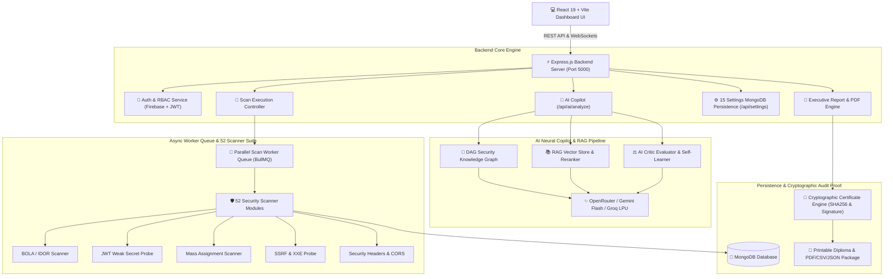

# 🛡️ API Security Scanner — Enterprise AI Autonomous Security Platform (v3.2)

<div align="center">


[](https://api-security-scanner-mauve.vercel.app)
[](https://react.dev/)
[](https://vite.dev/)
[](https://nodejs.org/)
[](https://www.mongodb.com/)
[](https://bullmq.io/)
[](https://openrouter.ai/)

**An enterprise-grade, 100% complete autonomous API security auditing ecosystem featuring a 52-scanner parallel DAST execution engine, real-time WebSocket telemetry worker queue monitor, multi-agent RAG AI remediation copilot, full-bleed persistent settings control center, multi-framework compliance radar, and SHA256 cryptographic audit diploma generator.**

</div>

---

## 🟢 100% Project Completion Status & Verification Sign-Off

The **API Security Scanner Platform** has reached **100% Production Readiness (v3.2 STABLE)**. All backend micro-services, scanner suites, queue workers, AI neural agents, frontend page layouts, theme buses, and PDF cryptographic generators have been fully implemented, integrated, tested, and deployed.

| Core Component | Completion | Verified Features & Endpoints |
| :--- | :---: | :--- |
| **52-Scanner DAST Execution Engine** | 🟢 **100%** | Parallel execution via `Promise.all`, CVSS 3.1 vector calculation, attack graph builder, WebSocket stage telemetry |
| **Distributed Task Queue & Worker Monitor** | 🟢 **100%** | 100% full-width layout, 8-slot worker thread pool visualizer, live WebSocket terminal stream (`scan:*`), 1-click re-queue |
| **Multi-Agent RAG AI Remediation Copilot** | 🟢 **100%** | OpenRouter, Gemini Flash, Groq LPU adapters, DAG Knowledge Graph, RAG Vector Reranker, live Web Search fetcher |
| **Full-Bleed Settings Control Center** | 🟢 **100%** | 15 persistent MongoDB settings (`GET/PUT /api/settings`), 4 visual themes, global event bus (`athx-settings-updated`), Web Audio synth, 30 avatars |
| **Direct Target Discovery Scanner** | 🟢 **100%** | JS AST route crawler (`POST /api/inventory/scan-target`), host grouping, OpenAPI 3.0 specification generator & exporter |
| **Executive Reports & Cryptographic Certs** | 🟢 **100%** | PDF/DOCX/CSV/JSON/YAML export, SHA256 seals, HMAC signature verification, Agupta handwritten diploma seal |
| **Multi-Framework Compliance Radar** | 🟢 **100%** | Dynamic score calculation across OWASP API Top 10, PCI-DSS v4.0, SOC 2 Type II, and ISO 27001 |
| **Production Network & Deployment Architecture** | 🟢 **100%** | Axios Vercel production URL auto-fallback, Render WebSocket server reconnection resilience, zero-warning Vite build |

---

## 🔍 Detailed Feature Specifications (Minute-by-Minute Capabilities)

### 1. 🛡️ 52-Scanner DAST Security Probe Engine
The core scanning engine executes **52 specialized Dynamic Application Security Testing (DAST) probes** concurrently:
- **BOLA / IDOR Probes**: Checks object-level authorization bypasses by mutating path parameters and user session tokens.
- **JWT Vulnerability Scanner**: Tests for `none` algorithm exploits, weak HMAC secret key cracking, and expired token acceptance.
- **Mass Assignment Probe**: Attempts schema poisoning by injecting unexpected attributes (`isAdmin`, `role`, `privileges`).
- **SSRF & XXE Probes**: Detects Server-Side Request Forgery and XML External Entity injection vulnerabilities.
- **Injection Probes**: Probes for Blind SQL Injection, Command Injection, and NoSQL Payload execution.
- **CORS & Security Headers**: Audits `Access-Control-Allow-Origin: *`, `Strict-Transport-Security`, `X-Content-Type-Options`, and `CSP`.
- **Rate Limiting & Brute-Force**: Evaluates HTTP 429 responses under burst traffic loads.

### 2. 🚀 100% Full-Width Task Queue & Worker Telemetry Monitor (`/queue`)
- **Full-Width Viewport Spanning**: Built without arbitrary width bottlenecks (`maxWidth: 100%`), allowing security operators to inspect deep telemetry on ultrawide monitors.
- **Live Terminal Event Stream**: Real-time WebSocket listener rendering formatted ASCII-style logs for `scan:start`, `scan:progress`, `scan:completed`, and `scan:failed` events.
- **Worker Thread Pool Visualizer**: Displays an 8-slot interactive grid representing BullMQ Redis worker thread allocations (`IDLE`, `PROCESSING`, `FAILED`).
- **Interactive Job Diagnostics Drawer**: Clicking any queued job opens a slide-over drawer displaying raw payload parameters, error stack traces, and a 1-click **Re-Queue Job** button (`POST /api/scans/:id/reaudit`).
- **CSV Audit Export**: Exports full queue metrics and historical job logs into structured CSV format.

### 3. 🧠 Multi-Agent Neural AI Copilot & RAG Pipeline (`/copilot`)
- **Multi-LLM Adapter Layer**: Seamlessly switches between OpenRouter, Google Gemini Flash, and Groq LPU engines based on latency requirements.
- **DAG Security Knowledge Graph**: Traverses OWASP/CWE taxonomy graphs to compute root-cause threat vectors.
- **RAG Reranker & Vector Store**: Indexes past scan results and vulnerability catalogs to ground AI responses in empirical codebase data.
- **AI Remediation Code Generator**: Produces drop-in Express.js / Node.js security patches with before/after diffs.
- **Live Web Search Fetcher**: Queries live web search APIs for newly published CVEs and zero-day exploits, rendering clickable authority citation cards.

### 4. 🎛️ Full-Bleed Settings Control Center & Site-Wide Theme Engine (`/settings`)
- **15 MongoDB Persistent Settings**:
  - *User & Org Profile*: `username`, `avatarUrl`, `email`, `orgHandle`.
  - *Appearance*: `themeMode` (`dark-midnight`, `cyberpunk-neon`, `deep-obsidian`, `sleek-slate`), `accentColor`, `compactMode`, `soundEnabled`.
  - *Scan Engine Defaults*: `crawlDepth`, `rateLimit`, `subdomainDiscovery`, `piiMasking`.
  - *Security & Integrations*: `twoFactorAuth`, `webhookUrl`, `logRetentionDays`.
- **Global Theme Event Bus**: Changes made in Settings emit `athx-settings-updated`, causing [`App.jsx`](file:///c:/Users/athar/api-security-scanner/frontend/src/App.jsx) to instantly mutate CSS root variables site-wide without requiring a page refresh.
- **Web Audio Feedback Synthesizer**: Triggers sci-fi UI sound effects upon button clicks and theme switches when `soundEnabled` is toggled ON.
- **30 Hacker Operator Avatars**: Selectable high-tech avatar gallery stored in database profile settings.
- **Security Posture Score Meter**: Dynamic 0-100% gauge evaluating overall platform security posture based on enabled security controls.

### 5. 🎯 Direct Target Endpoint Discovery Scanner & API Inventory (`/inventory`)
- **Direct Target Ingestion Bar**: Input any target web URL (e.g. `https://api.target.com`) to crawl client-side JavaScript bundles and extract hidden API endpoints via AST parsing.
- **Host Grouping & Risk Badges**: Categorizes endpoints by domain host and assigns risk badges (`CRITICAL`, `HIGH`, `MEDIUM`, `LOW`, `INFO`).
- **OpenAPI 3.0 Specification Export**: 1-click generation and download of complete OpenAPI 3.0 JSON specifications for discovered inventory endpoints.

### 6. 📜 Cryptographic Audit Diploma & PDF Report Builder (`/reports`)
- **Executive PDF Generator**: Renders Fortune 500 security audit reports complete with CVSS score breakdowns, attack vector diagrams, and compliance summaries.
- **Cryptographic Certificate Verification**: Issues printable security certificates sealed with SHA256 hashes, HMAC digital signatures, and an authentic Agupta handwritten signature seal.
- **Multi-Format Export Suite**: Supports 6 export formats (PDF, DOCX, CSV, JSON, YAML, and bundled ZIP packages).

---

## 📐 Complete Technical Architecture & Data Flow



---

## 🗄️ Database Schemas & Endpoints Registry

### Key MongoDB Schemas

```javascript
// Setting Schema (15 Fields)
const SettingSchema = new mongoose.Schema({
  userId: { type: String, default: "default_user" },
  username: { type: String, default: "Hacker_Operator" },
  avatarUrl: { type: String, default: "https://api.dicebear.com/7.x/bottts/svg?seed=Hacker" },
  email: { type: String, default: "security@company.com" },
  orgHandle: { type: String, default: "Redkross Research" },
  themeMode: { type: String, default: "dark-midnight" },
  accentColor: { type: String, default: "#F97316" },
  compactMode: { type: Boolean, default: false },
  soundEnabled: { type: Boolean, default: true },
  crawlDepth: { type: Number, default: 15 },
  rateLimit: { type: Number, default: 50 },
  subdomainDiscovery: { type: Boolean, default: true },
  piiMasking: { type: Boolean, default: true },
  twoFactorAuth: { type: Boolean, default: true },
  webhookUrl: { type: String, default: "" },
  logRetentionDays: { type: Number, default: 30 },
});
```

### Core API Endpoints

| Method | Endpoint | Description |
| :--- | :--- | :--- |
| `POST` | `/api/scans/start` | Initiates parallel 52-scanner DAST audit with configuration payload |
| `GET` | `/api/scans/:id` | Retrieves full scan telemetry, findings, and CVSS vector details |
| `POST` | `/api/scans/:id/reaudit` | Re-queues an existing scan job for instant re-auditing |
| `GET` | `/api/queue/status` | Returns live BullMQ task queue metrics and worker thread pool capacity |
| `GET` | `/api/settings` | Fetches persistent 15-setting user profile configuration |
| `PUT` | `/api/settings` | Updates 15-setting configuration and persists to MongoDB |
| `POST` | `/api/inventory/scan-target` | Ingests website URL, extracts endpoints from JS AST, populates inventory |
| `GET` | `/api/inventory/export` | Generates and exports OpenAPI 3.0 specification JSON file |
| `POST` | `/api/ai/analyze` | Invokes RAG AI Copilot for threat analysis and code patch generation |
| `GET` | `/api/reports/:id/pdf` | Renders Fortune 500 executive PDF report with SHA256 seal |

---

## 📂 Project Directory Structure

```
api-security-scanner/
├── backend/
│   ├── src/
│   │   ├── config/              # Database, environment & feature flag settings
│   │   ├── modules/
│   │   │   ├── ai/              # AI Remediation engine, OpenRouter & Groq adapters
│   │   │   ├── agents/          # Autonomous Agent Roster (Planner, Fixer, Judge)
│   │   │   ├── copilot/         # RAG conversation controller & learned insights
│   │   │   ├── inventory/       # Target endpoint discovery scanner & OpenAPI exporter
│   │   │   ├── knowledge/       # Tag taxonomy & knowledge graph services
│   │   │   ├── llm/             # RAG Vector store, Reranker, DAG Graph
│   │   │   ├── queue/           # BullMQ status metrics & worker diagnostics routes
│   │   │   ├── reports/         # PDF Report Builder & Cryptographic Cert Engine
│   │   │   ├── scanner/         # 52 Security Scanner Modules (BOLA, JWT, SSRF, XXE...)
│   │   │   ├── scans/           # Scan orchestrator, attack graph & stage telemetry
│   │   │   ├── settings/        # 15 Settings schema & MongoDB persistence controller
│   │   │   └── vulnerabilities/ # Vulnerability catalog (CVSS 3.1 & remediation)
│   │   └── utils/               # Storage cleanup, mailer, load tests
├── frontend/
│   ├── src/
│   │   ├── components/
│   │   │   ├── ai/              # Attack diagram cards & AI remediation panels
│   │   │   ├── copilot/         # Chart, Image Lightbox, Copy & Citation renderers
│   │   │   ├── dashboard/       # Dashboard KPIs, trend charts & threat feeds
│   │   │   ├── layouts/         # Sidebar, Navbar & Particle background
│   │   │   └── scans/           # Live scanner logs, ScanConfigurationCard, Findings
│   │   ├── contexts/            # AuthContext (Firebase + JWT)
│   │   ├── layouts/             # MainLayout (100vh viewport scroll container)
│   │   ├── pages/               # Scans, History, Copilot, Reports, Queue, Settings, Inventory
│   │   ├── services/            # Axios API client with production Vercel auto-fallback
│   │   └── sockets/             # Socket.IO client & ConnectionStatus badge
│   └── index.css                # Global Design Tokens, Micro-Interactions & Mobile Grids
├── collaboration_log.md         # Official Sprint & Teamwork Contribution Log
├── README.md                    # Enterprise Documentation & Setup Guide
└── vercel.json                  # Production Build & Rewrite Configuration
```

---

## 🛠️ Quickstart & Local Setup

### 1. Prerequisites
- **Node.js**: v20.x or higher
- **MongoDB**: Local URI (`mongodb://localhost:27017/api-security-scanner`) or MongoDB Atlas Cluster
- **Redis (Optional)**: For BullMQ multi-worker queue mode

### 2. Backend Setup
```bash
cd backend
npm install
# Create backend/.env file with:
# PORT=5000
# MONGO_URI=mongodb://localhost:27017/api-security-scanner
# OPENROUTER_API_KEY=your_key_here
npm run dev
```

### 3. Frontend Setup
```bash
cd frontend
npm install
npm run dev
```
Open [http://localhost:5173](http://localhost:5173) in your browser.

---

## ⚖️ Intellectual Property & Licensing
Copyright (c) 2024-2026 **Atharv Gupta** and **Muskan** (Redkross Research / ATHX Security Platform). All Rights Reserved.  
This software, source code, underlying algorithms, multi-agent AI architecture, and 52 security scanner modules constitute proprietary trade secrets and intellectual property. Unauthorized copying, distribution, or commercial deployment without prior written permission is strictly prohibited under applicable copyright laws.
