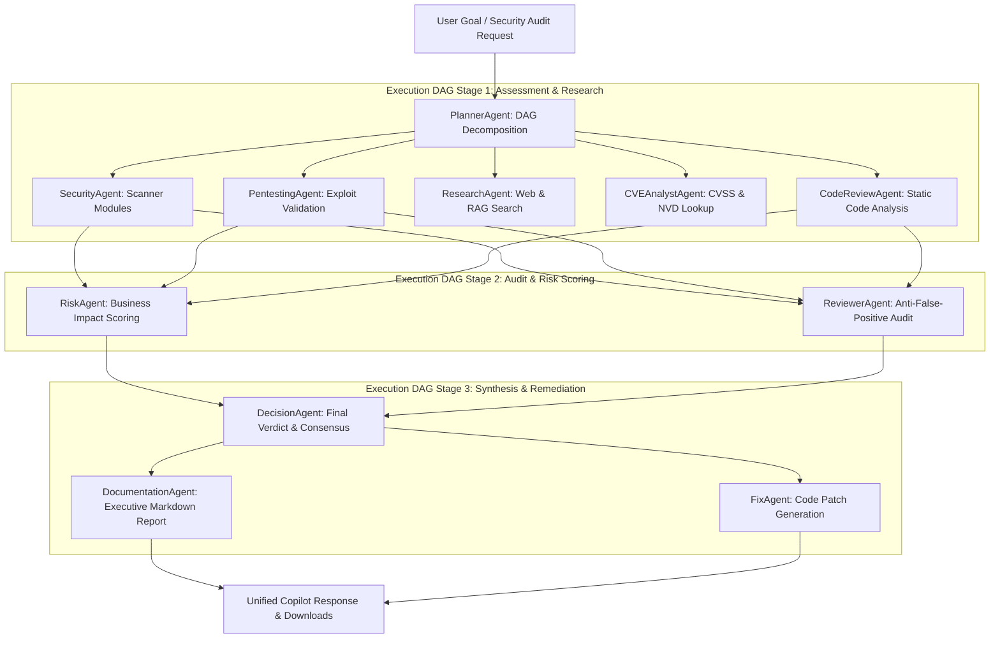
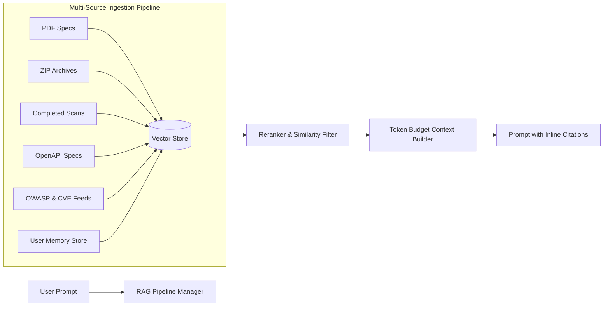

# 🛡️ ATHX Security — Enterprise AI API Security Platform

<div align="center">


[](https://react.dev/)
[](https://vite.dev/)
[](https://nodejs.org/)
[](https://www.mongodb.com/)
[](https://bullmq.io/)
[](https://openrouter.ai/)

**An elite, high-performance API vulnerability assessment platform, multi-agent AI debate orchestrator, enterprise RAG engine, and DevSecOps automated scanner.**

</div>

---

## ⚡ Platform Overview & Roadmap Progress

ATHX Security combines active DAST crawling, automated pentesting, DAG multi-agent debate loops, enterprise RAG document ingestion, and long-term memory structures into a unified production-grade security suite.

### 🎯 Roadmap Status (Sprints 1 – 50: `100% DONE`)

| Milestone Phase | Sprints | Focus Area | Status |
| :--- | :---: | :--- | :---: |
| **Phase 1: Core Scanner & Adapters** | Sprints 1 – 15 | Multi-LLM Adapters, Fallback Chain, Confidence Engine, Decision Engine | **✅ COMPLETED** |
| **Phase 2: Debate & Copilot UI** | Sprints 16 – 24 | Copilot Chat UI, Rich Block Renderers, Debate Transcripts | **✅ COMPLETED** |
| **Phase 3: RAG & Document Pipeline** | Sprints 25 – 30 | PDF & ZIP Ingestion, 4th LLM Judge, Chat & KB Memory Ingestion | **✅ COMPLETED** |
| **Phase 4: Multi-Agent Roster I** | Sprints 31 – 35 | Planner, Security, Pentesting, Research, CVE Agents & Inline RAG Citations | **✅ COMPLETED** |
| **Phase 5: Multi-Agent Roster II & DAG** | Sprints 36 – 43 | CodeReview, Documentation, Risk, Reviewer, Decision, Fix Agents, DAG Engine, SQL & Download Renderers | **✅ COMPLETED** |
| **Phase 6: Advanced RAG & Human-in-the-Loop** | Sprints 44 – 50 | Vector DB Schema, Approval Checkpoints, Scan & OpenAPI Ingestion, OWASP/CVE Feeds & Memory | **✅ COMPLETED** |

---

## 🧠 Multi-Agent Roster & DAG Orchestrator

The system features **11 specialized AI security agents** orchestrated via a DAG (Directed Acyclic Graph) workflow engine (`agent.orchestrator.js`).



### Specialized Security Agents Roster

| Agent Name | Primary Role | Default Provider | Model Isolation Matrix (Sprint 42) |
| :--- | :--- | :---: | :--- |
| `PlannerAgent` | Goal Decomposition & DAG Sub-task Generation | OpenAI | Generates ordered sub-tasks with `dependsOn` linkages |
| `SecurityAgent` | DAST Scanner Engine Wrapper | Claude | Executes active vulnerability probes |
| `PentestingAgent` | Exploit Vector & Payload Validator | Gemini | Validates exploitability bounds |
| `ResearchAgent` | Web Search & RAG Context Retriever | Pollinations | Queries vector store & live web security feeds |
| `CVEAnalystAgent` | NVD Database & CVSS 3.1 Specialist | Pollinations | Calculates vector metrics & CVE lookup |
| `CodeReviewAgent` | Static AI Code & OpenAPI Reviewer | Claude | Reviews source code & OpenAPI specifications |
| `DocumentationAgent` | Executive Report Writer | Gemini | Formats findings into executive markdown |
| `RiskAgent` | Business & Financial Risk Scorer | Gemini | Wraps CVSS 3.1 calculation & asset criticality |
| `ReviewerAgent` | Cross-Verification & Anti-False-Positive Auditor | OpenAI | **Isolated Model**: Never shares provider with claim agent |
| `DecisionAgent` | Consolidated Verdict Synthesizer | Claude | Resolves conflicts & outputs confidence rating |
| `FixAgent` | Autonomous Remediation Patch Engineer | Gemini | Generates concrete code-level patch snippets |

---

## 🎨 Rich Content Renderers & Interactive UI

The frontend `BlockRenderer` supports 10+ dynamic content block types:

1. **`CommandBlock` (Sprint 29)**: Terminal block for CMD, PowerShell, and Bash with prompt badges (`$`, `PS>`) and 1-click copy.
2. **`HtmlPreviewBlock` (Sprint 33)**: Live sandboxed iframe preview (`sandbox="allow-scripts"`) with Code / Live UI toggle.
3. **`SqlBlock` (Sprint 38)**: SQL syntax highlighting with client-side syntax validation indicator (`Syntax OK` / `Syntax Flagged`).
4. **`DownloadButton` (Sprint 43)**: 1-click downloadable files (`.js`, `.py`, `.sql`, `.json`, `.yaml`, `.md`).
5. **JSON / YAML Viewers**: Collapsible key-value inspector with syntax formatting.
6. **Alerts & Accordions**: Info, Warning, Critical, and Success badges with expandable sections.

---

## 📚 Enterprise RAG Engine Architecture

The RAG pipeline (`rag.pipeline.js` & `context-builder.js`) retrieves and injects security knowledge into agent prompts with token-budget truncation and inline citations (`[1]`, `[2]`).



---

## 🔀 Branch Sync & Collaboration Matrix

Project development follows a strict owner-branch isolation policy with 100% synchronization across all active local and remote branches.

| Branch Name | Owner | Role | Status |
| :--- | :--- | :--- | :---: |
| `atharv-dev` | **Atharv** | Backend Core, RAG Engine, Multi-Agent Roster, DAG Orchestrator | 🟢 Synced (`228fe1a`) |
| `muskan-dev` | **Muskan** | Frontend Copilot UI, Rich Renderers, Live Preview, Downloads | 🟢 Synced (`228fe1a`) |
| `main` | **Release** | Verified Production Deployment Candidate | 🔵 Production (`228fe1a`) |

---

## 🛠️ Quick Start & Installation

### Prerequisites
- Node.js 20+ (v24 recommended)
- npm 10+
- MongoDB (optional for local in-memory fallback mode)

### 1. Clone & Install Dependencies
```bash
git clone https://github.com/Atharv-design/api-security-scanner.git
cd api-security-scanner

# Install backend dependencies
cd backend && npm install

# Install frontend dependencies
cd ../frontend && npm install
```

### 2. Environment Configuration
Create `.env` in `backend/`:
```env
PORT=5000
MONGODB_URI=mongodb://localhost:27017/api-security-scanner
JWT_ACCESS_SECRET=your_jwt_access_secret_min_32_chars
JWT_REFRESH_SECRET=your_jwt_refresh_secret_min_32_chars
CLIENT_URL=http://localhost:5173
```

### 3. Run Locally
```bash
# Terminal 1: Backend Server
cd backend && npm run dev

# Terminal 2: Frontend Client
cd frontend && npm run dev
```

---

## 📄 License
Distributed under the MIT License. See `LICENSE` for details.
