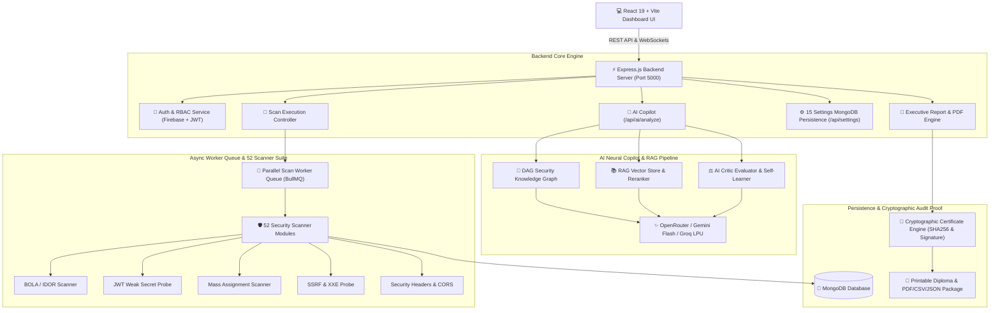

# 🛡️ API Security Scanner — Enterprise AI Autonomous Security Platform (v3.2)

<div align="center">


[](https://react.dev/)
[](https://vite.dev/)
[](https://nodejs.org/)
[](https://www.mongodb.com/)
[](https://bullmq.io/)
[](https://openrouter.ai/)

**An enterprise autonomous API vulnerability assessment platform, 52-scanner DAST execution engine, multi-agent AI remediation copilot, distributed task queue telemetry monitor, full-bleed settings control center, multi-framework compliance radar, and cryptographic audit proof generator.**

</div>

---

## 📐 System Architecture Diagram



---

## ⚡ Key Platform Capabilities

### 1. 🚀 100% Full-Width Task Queue & Worker Telemetry Monitor (`/queue`)
- Real-time **WebSocket Terminal Event Stream Log** capturing `scan:start`, `scan:progress`, `scan:completed`, and `scan:failed` live logs.
- **8-Slot Worker Thread Pool Capacity Visualizer Grid** showing active slot allocation and CPU state.
- **1-Click Re-queueing Action** with instant progress state animation and CSV audit export.

### 2. 🎛️ Full-Bleed Settings Control Center (`/settings`)
- **15 Persistent Settings Fields** backed by MongoDB (`GET /api/settings`, `PUT /api/settings`).
- **Interactive Visual Theme Cards** (`Dark Midnight`, `Cyberpunk Neon`, `Deep Obsidian`, `Sleek Slate`) mutating CSS root variables site-wide in real-time via `athx-settings-updated` global event bus.
- **30 Hacker Operator Avatars Gallery**, Web Audio Synthesizer, dynamic Security Posture Score meter (0-100%), and 1-click JSON backup export/import.

### 3. 🎯 Direct Target Discovery Scanner & API Inventory (`/inventory`)
- Direct website ingestion bar extracting API endpoints from JS ASTs.
- High-contrast URL input box, host grouping, risk badges, and 1-click **OpenAPI 3.0 Specification Export**.

### 4. 📊 Glassmorphic Security Overview Dashboard (`/dashboard`)
- Circular glowing **Security Grade Score Ring Meter** with score denominator (`51 / 100`).
- Ambient purple **AI Security Copilot Banner** with live pulse badge.
- **180px High-Definition Scan Activity Trend Chart** with glowing dual area gradients.

---

## 📂 Project Directory Structure

```
api-security-scanner/
├── backend/
│   ├── src/
│   │   ├── config/              # Database, environment & feature flag settings
│   │   ├── modules/
│   │   │   ├── ai/              # AI Remediation engine & multi-LLM adapters
│   │   │   ├── agents/          # Autonomous Agent Roster (Planner, Fixer, Judge)
│   │   │   ├── copilot/         # Chat controllers & learned insight model
│   │   │   ├── inventory/       # Target endpoint discovery scanner & OpenAPI exporter
│   │   │   ├── knowledge/       # Tag taxonomy & knowledge graph services
│   │   │   ├── llm/             # RAG Vector store, Reranker, DAG Knowledge Graph
│   │   │   ├── queue/           # BullMQ status metrics & worker diagnostics routes
│   │   │   ├── reports/         # PDF Report Builder & Cryptographic Cert Engine
│   │   │   ├── scanner/         # 52 Security Scanner Modules (BOLA, JWT, SSRF, XXE...)
│   │   │   ├── scans/           # Scan orchestrator, attack graph & stage telemetry
│   │   │   ├── settings/        # 15 Settings schema & MongoDB persistence controller
│   │   │   └── vulnerabilities/ # Vulnerability catalog (CVSS 3.1 & remediation)
│   │   └── utils/               # Storage cleanup, mailer, load tests
├── frontend/
│   ├── src/
│   │   ├── components/
│   │   │   ├── ai/              # Attack diagram cards & AI remediation panels
│   │   │   ├── copilot/         # Chart, Image Lightbox, Copy & Citation renderers
│   │   │   ├── dashboard/       # Dashboard KPIs, trend charts & threat feeds
│   │   │   ├── layouts/         # Sidebar, Navbar & Particle background
│   │   │   └── scans/           # Live scanner logs, ScanConfigurationCard, Findings
│   │   ├── contexts/            # AuthContext (Firebase + JWT)
│   │   ├── layouts/             # MainLayout (100vh viewport scroll container)
│   │   ├── pages/               # Scans, History, Copilot, Reports, Queue, Settings, Inventory
│   │   ├── services/            # Axios API client with production Vercel auto-fallback
│   │   └── sockets/             # Socket.IO client & ConnectionStatus badge
│   └── index.css                # Global Design Tokens, Micro-Interactions & Mobile Grids
├── collaboration_log.md         # Official Sprint & Teamwork Contribution Log
├── README.md                    # Enterprise Documentation & Setup Guide
└── vercel.json                  # Production Build & Rewrite Configuration
```

---

## 🛠️ Quickstart & Local Setup

### 1. Prerequisites
- **Node.js**: v20.x or higher
- **MongoDB**: Local URI or MongoDB Atlas Cluster
- **Redis (Optional)**: For BullMQ multi-worker queue mode

### 2. Backend Setup
```bash
cd backend
npm install
# Configure backend/.env
# PORT=5000, MONGO_URI=mongodb://localhost:27017/api-security-scanner
npm run dev
```

### 3. Frontend Setup
```bash
cd frontend
npm install
npm run dev
```
Open [http://localhost:5173](http://localhost:5173) in your browser.

---

## ⚖️ Intellectual Property & Licensing
Copyright (c) 2024-2026 **Atharv Gupta** and **Muskan** (Redkross Research / ATHX Security Platform). All Rights Reserved.
