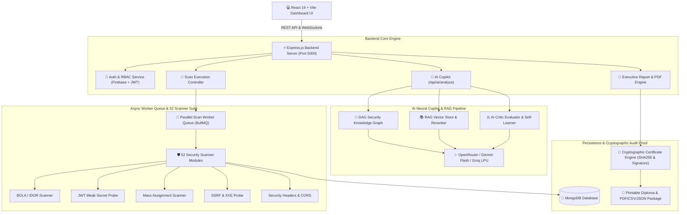
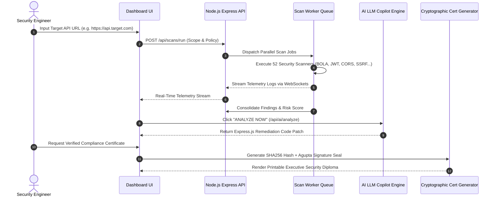

# 🛡️ API Security Scanner — Enterprise AI Autonomous Security Platform (v3.0)

<div align="center">


[](https://react.dev/)
[](https://vite.dev/)
[](https://nodejs.org/)
[](https://www.mongodb.com/)
[](https://bullmq.io/)
[](https://openrouter.ai/)

**An enterprise autonomous API vulnerability assessment platform, 52-scanner DAST execution engine, multi-agent AI remediation copilot, multi-framework compliance radar, and cryptographic audit proof generator.**

</div>

---

## 📐 System Architecture Diagram



---

## ⚡ Autonomous Scanning & Remediation Flow



---

## 📂 Project Directory Structure

```
api-security-scanner/
├── backend/
│   ├── src/
│   │   ├── config/              # Feature flags & MongoDB connection
│   │   ├── modules/
│   │   │   ├── ai/              # AI Remediation engine & multi-LLM adapters
│   │   │   ├── agents/          # Autonomous Agent Roster (Planner, Fixer, Judge)
│   │   │   ├── copilot/         # Chat controllers & learned insight model
│   │   │   ├── knowledge/       # Tag taxonomy & knowledge graph services
│   │   │   ├── llm/             # RAG Vector store, Reranker, DAG Knowledge Graph
│   │   │   ├── reports/         # PDF Report Builder & Cryptographic Cert Engine
│   │   │   ├── scanner/         # 52 Security Scanner Modules
│   │   │   ├── scans/           # Scan orchestrator, attack graph & stage telemetry
│   │   │   └── vulnerabilities/ # Vulnerability catalog definitions
│   │   └── utils/               # Storage cleanup cron, mailer, load tests
├── frontend/
│   ├── src/
│   │   ├── components/
│   │   │   ├── ai/              # Attack diagram cards & remediation panels
│   │   │   ├── copilot/         # Chart, Image Lightbox, Copy & Citation renderers
│   │   │   ├── dashboard/       # Dashboard KPIs, trend charts & threat feeds
│   │   │   ├── layouts/         # Sidebar, Navbar & Particle background
│   │   │   └── scans/           # Live scanner logs, Attack Surface Map, Findings
│   │   ├── contexts/            # AuthContext (Firebase + JWT)
│   │   ├── layouts/             # MainLayout (100vh viewport scroll container)
│   │   ├── pages/               # Scans, History, Copilot, Reports, Queue, Settings
│   │   ├── services/            # Axios API client with production Vercel auto-fallback
│   │   └── sockets/             # Socket.IO client & ConnectionStatus badge
│   └── index.css                # Global Design Tokens & Responsive Utilities
├── collaboration_log.md         # Official Sprint & Teamwork Contribution Log
├── README.md                    # Enterprise Documentation & Setup Guide
└── vercel.json                  # Production Build & Rewrite Configuration
```

---

## 🌟 Complete Feature Inventory

### 🛡️ 1. 52 Specialized Security Scanner Modules
The platform embeds 52 specialized automated DAST security scanners covering all major API threat vectors:

- **OWASP API Top 10 (2023 Categories)**:
  - `bola-idor.scanner.js`: Broken Object-Level Authorization & IDOR probe.
  - `bfla.scanner.js`: Broken Function-Level Authorization scanner.
  - `mass-assignment.scanner.js`: Object property injection & mass assignment vulnerability probe.
  - `jwt-weak-secret.scanner.js`: JWT signature forgery, `none` algorithm, and dictionary secret cracker.
  - `rate-limiting.scanner.js`: Unrestricted resource consumption & rate limit bypass testing.
- **Injection & Server-Side Probes**:
  - `ssrf.scanner.js`: Server-Side Request Forgery & internal metadata endpoint probes.
  - `xxe.scanner.js`: XML External Entity injection testing.
  - `ssti.scanner.js`: Server-Side Template Injection.
  - `nosql-injection.scanner.js`: MongoDB / CouchDB operator injection.
  - `ldap-injection.scanner.js` & `xpath-injection.scanner.js`: Directory & XML query injection.
- **Infrastructure & Configuration Leakage**:
  - `cloud-metadata.scanner.js`: AWS / GCP / Azure IMDSv1/v2 metadata exposure.
  - `git-exposure.scanner.js` & `env-exposure.scanner.js`: `.git/config` & `.env` environment file leaks.
  - `redis-exposure.scanner.js` & `grpc-security.scanner.js`: Unauthenticated Redis & gRPC service exposure.
  - `swagger-exposure.scanner.js`: Exposed OpenAPI / Swagger documentation endpoints.
  - `cors-null-origin.scanner.js`: Misconfigured CORS with trusted null or wildcards.

---

### 🤖 2. AI Neural Copilot & Dynamic Remediation Engine
- **Multi-LLM Adapter Architecture**: Supports OpenRouter, Google Gemini Flash (`gemini-flash-latest`), and Groq LPU (`llama-3.3-70b`) with automatic failover.
- **DAG Knowledge Graph**: Directed Acyclic Graph connecting OWASP API categories, CWE taxonomies, and remediation patterns.
- **AI Critic Evaluator**: Self-learning feedback pipeline that refines rule accuracy based on user validation.

---

### 📜 3. Cryptographic Compliance Certificate System
- **Verified Audit Certificate**: Renders a printable A4 executive diploma featuring gold/emerald double borders, SHA256 audit hashes, HMAC integrity seals, and a transparent handwritten `Agupta` signature stamp.
- **Multi-Framework Matrix**: Evaluates security compliance across **OWASP API Top 10**, **PCI-DSS v4.0**, **SOC 2 Type II**, and **ISO 27001**.

---

## 👥 Sprint & Author Ownership Matrix

| Feature Module | Primary Author | Status | Deliverables |
| :--- | :--- | :--- | :--- |
| **Backend & 52 Scanners** | **Atharv Gupta** | 🟢 Complete | `scan.service.js`, `vulnerability.catalog.js`, 52 scanner modules |
| **AI Copilot & DAG RAG** | **Atharv Gupta** | 🟢 Complete | `dag.knowledge.graph.js`, `openrouter.service.js`, `critic.evaluator.service.js` |
| **Network & Deployment** | **Atharv Gupta** | 🟢 Complete | `api.js` Vercel auto-fallback, Render WebSocket integration, PostCSS fixes |
| **Frontend UI & Layouts** | **Muskan** | 🟢 Complete | `MainLayout.jsx`, `Sidebar.jsx`, single-container scroll system in `index.css` |
| **Reports & Certificate UI**| **Atharv & Muskan** | 🟢 Complete | `ReportsPage.jsx`, `pdfReport.service.js`, Agupta handwritten signature seal |

---

## 🔮 Future Roadmap (Phase 4 / Sprints 151-200)

| Feature | Description | Target Quarter |
| :--- | :--- | :--- |
| **eBPF Kernel Probe Agent** | Kernel-level API traffic inspection without proxy latency | Q3 2026 |
| **Autonomous DAST Fuzzer** | AI-generated mutations for GraphQL, gRPC, and WebSockets | Q3 2026 |
| **Kubernetes Operator** | Native K8s CRD (`APISecurityScan`) for continuous CI/CD scanning | Q4 2026 |
| **SAML 2.0 / Enterprise SSO**| Okta, Azure AD, and PingIdentity integration | Q4 2026 |

---

## 🚀 Local Setup & Installation Guide

### Prerequisites
- **Node.js**: v20.x or higher (v24 recommended)
- **MongoDB**: Local MongoDB instance or MongoDB Atlas connection string
- **Git**: Installed and configured

### 1. Clone Repository
```bash
git clone https://github.com/Redkrossresearch/api-security-scanner.git
cd api-security-scanner
```

### 2. Backend Setup
```bash
cd backend
npm install
# Create a .env file with your PORT, MONGODB_URI, and OPENROUTER_API_KEY
npm run dev
```

### 3. Frontend Setup
```bash
cd ../frontend
npm install
npm run dev
```
Open your browser at `http://localhost:5173`.

---

## 📄 Intellectual Property, Copyright & Proprietary License

```
Copyright (c) 2024-2026 Atharv Gupta & Muskan. All Rights Reserved.
Repository: Redkrossresearch/api-security-scanner
Platform: ATHX Security Platform (Enterprise API Security Engine)
```

### ⚖️ Legal Terms & Ownership Statement
This repository, source code, underlying algorithms, multi-agent RAG orchestration architecture, 52 specialized DAST security scanner modules, custom user interface design system, and associated documentation are the **exclusive proprietary intellectual property** of **Atharv Gupta** and **Muskan** (operating under Redkross Research / ATHX Security Platform).

1. **Proprietary Notice**: Unauthorized copying, modification, redistribution, reverse engineering, sublicensing, or commercial deployment of this software, in whole or in part, via any medium, without the express written permission of the copyright holders is strictly prohibited.
2. **Usage Restrictions**: Permission to view this repository is granted solely for code review, audit evaluation, and demonstration purposes. No license is granted for public hosting, commercial resale, or integration into third-party security platforms without an explicit Enterprise License Agreement.
3. **Trademark & Brand Protection**: "ATHX Security", "ATHX API Scanner", and related logos, badges, and seals are proprietary marks of Atharv Gupta & Muskan.

For enterprise licensing inquiries, commercial partnerships, or vulnerability disclosure:
- **Lead Security Architect**: Atharv Gupta ([`atharvgupta720@gmail.com`](mailto:atharvgupta720@gmail.com))
- **Co-Author & Lead UI Engineer**: Muskan
- **Organization**: Redkross Research / ATHX Security Platform
