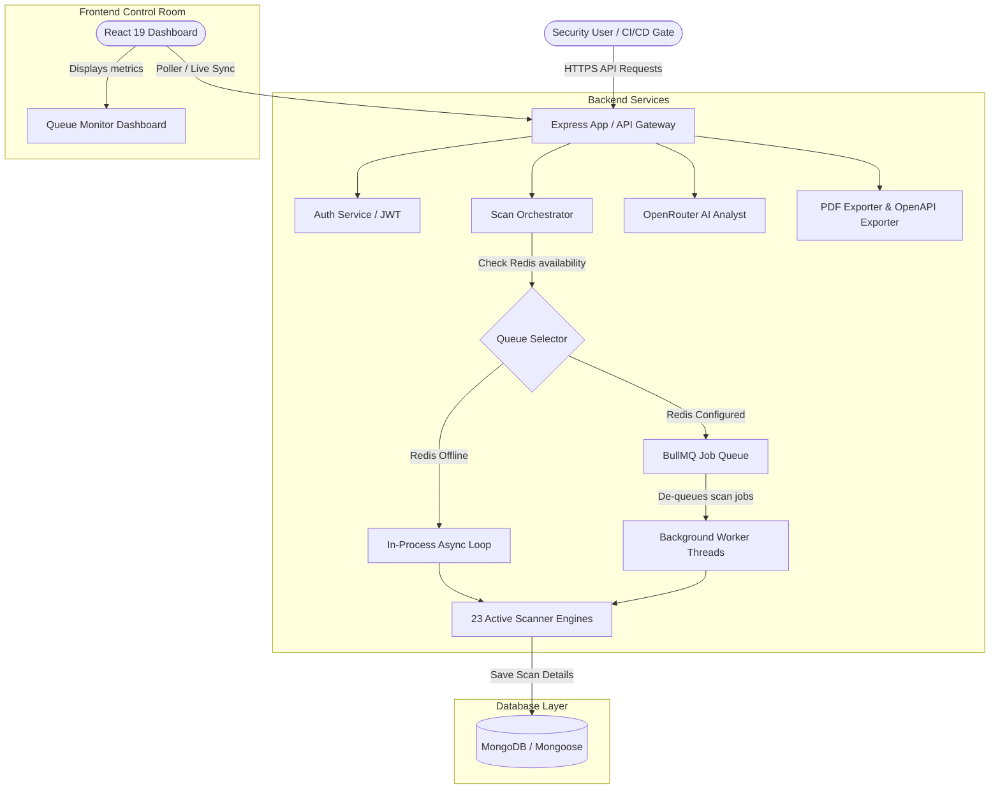

# 🛡️ ATHX Security (Enterprise API Security Platform)

<div align="center">


[](https://react.dev/)
[](https://vite.dev/)
[](https://nodejs.org/)
[](https://www.mongodb.com/)
[](https://bullmq.io/)
[](https://openrouter.ai/)

**An elite, high-performance API vulnerability assessment platform and DevSecOps Orchestrator.**
</div>

ATHX Security enables organizations to assess, monitor, and secure their API endpoints dynamically. It runs a comprehensive suite of security checkers (active & passive), reverse-engineers API endpoints to generate standard OpenAPI specifications, compiles audit-ready PDF reports, integrates with CI/CD gates, and offers stack-specific AI remediation diffs via OpenRouter. 

Featuring a premium, glassmorphic dark UI, ATHX incorporates a dynamic background worker queue backed by Redis/BullMQ with a seamless local fallback.

---

## ⚡ Real Working vs. Simulated Status

To support zero-configuration local developer boot-ups, mock demonstrations, and live production environments, ATHX utilizes intelligent hybrid execution modes. Below is the precise implementation state across the codebase:

| Feature Module | Actual Working Status (Production-Ready) | Demo / Simulated State (No Credentials) | Production Ready? |
| :--- | :--- | :--- | :---: |
| **🤖 Core Scanners & Crawler** | Crawls forms, anchors, parameters via Axios and runs 23 active security audits (SQLi, XSS, Path Traversal, SSL, CORS, Cookies, exposed files). | None (Scanners execute live HTTP checks). | **Yes** ✅ |
| **⏳ Redis/BullMQ Worker Queue** | If `REDIS_URL` is set, background scanning is offloaded to a distributed BullMQ task queue. | Automatic fallback to in-process async worker loop if Redis is absent. | **Yes** ✅ |
| **🔄 Live Queue Monitor** | Monitors real-time queue states (Active, Waiting, Completed, Failed) and reports worker stats. | Switches to database pollers and active scanner logs when running in-process. | **Yes** ✅ |
| **🤖 AI Copilot Patches** | Calls OpenRouter LLMs to generate real-time code-level vulnerability fixes. | None (Generates live diffs via LLM). | **Yes** ✅ |
| **🗂️ OpenAPI Spec Exporter** | Maps database API inventory structures dynamically into standard OpenAPI v3.0 JSON specifications. | None (Generates live from scanned route schemas). | **Yes** ✅ |
| **🔒 PDF Audit Exporter** | Compiles executive security status, grades, WAF rules, and remediation actions into a polished PDF report. | None (Generates PDF streams dynamically). | **Yes** ✅ |
| **🐙 GitHub Integration** | Triggers centered popup OAuth, retrieves repos/branches, and commits workflow files. | Loads local OAuth authorization mock panel and simulated workflow sync. | **Yes** ✅ (With secrets) |
| **🦊 GitLab CI/CD Gate** | Renders dynamic `.gitlab-ci.yml` configs with break-the-build logic on High/Critical flaws. | Sync simulation displays UI/UX template placement. | **Template Ready** 🛠️ (Sync Simulated) |
| **👥 Multi-Tenant Teams & RBAC** | *In development* (MongoDB team schemas, membership levels, action logs, authorization middleware). | None | **Roadmap** ⏳ |

---

## 🚀 Key Modules & Capabilities

### 1. ⏳ Dual-Mode Task Queue & Real-Time Monitor
* **Production Redis Mode:** Scan payloads are enqueued into a BullMQ task queue. Independent worker threads spin up to handle heavy crawl operations without choking main API threads.
* **In-Process Mode Fallback:** Zero Redis dependency. If `REDIS_URL` is missing, the scanner switches to an async in-process runner thread, making local testing completely zero-setup.
* **Task Monitor Panel (`/queue`):** Renders a cyber-themed monitoring dashboard tracking active, waiting, completed, and failed jobs. Displays live worker concurrency stats and provides interactive job filtering.

### 2. 🛡️ Stack-Specific AI Code Patches
* **Interactive Diffs:** Prompts OpenRouter API to produce precise code-level remedies. Diffs are rendered in a gorgeous side-by-side or inline layout highlighting added (+) and deleted (-) lines.
* **WAF Rules Generation:** Automatically compiles production-ready firewall rules matching detected bugs (ModSecurity, Cloudflare, and AWS WAF).

### 3. 🏗️ CI/CD Security Gate Wizard (GitHub Actions & GitLab CI)
* **Shift-Left Automation:** Generates pipeline scripts that call ATHX trigger APIs and block merge requests if critical vulnerabilities are discovered.
* **GitHub Integration Popup:** Authenticates user via GitHub OAuth flow. Automatically lists repositories, identifies branches, and commits `.github/workflows/athx-security-scan.yml` automatically.
* **Manual Connection:** Fallback support allowing manual token connection using Personal Access Tokens (PAT).

### 4. 🗂️ API Discovery & Asset Management
* **OpenAPI Exporter:** Instantly generates OpenAPI documentation based on target API endpoints detected during the crawl stage.
* **Asset Security Leaderboard:** Ranks your digital assets based on aggregate security risk grades (A+ to F).

---

## 📐 System Architecture



---

## 🛠️ Installation & Setup

### Prerequisites
* **Node.js** v24+
* **MongoDB** (Local or Atlas URL)
* **Redis** (Optional: required for BullMQ queues)

---

### Step-by-Step Installation

#### 1. Clone the Repository
```bash
git clone https://github.com/Atharv-design/api-security-scanner.git
cd api-security-scanner
```

#### 2. Configure Environment Variables
Create a `.env` file in the `backend/` directory:
```env
NODE_ENV=development
PORT=5000
MONGODB_URI=your_mongodb_connection_string
JWT_ACCESS_SECRET=your_jwt_access_secret
JWT_REFRESH_SECRET=your_jwt_refresh_secret
CLIENT_URL=http://localhost:5173
OPENROUTER_API_KEY=your_openrouter_api_key

# --- BACKGROUND TASK QUEUE (REDIS) ---
# Add to enable BullMQ background worker queue. If commented out, falls back to In-Process mode.
# REDIS_URL=redis://127.0.0.1:6379
# QUEUE_CONCURRENCY=3

# --- LIVE GITHUB OAUTH ---
# Optional: Register an OAuth Application under GitHub Settings > Developer Settings
# GITHUB_CLIENT_ID=your_github_client_id
# GITHUB_CLIENT_SECRET=your_github_client_secret
```

#### 3. Launch the Backend Server
```bash
cd backend
npm install
npm run dev
```
*The terminal will output:*
`⚡ Scan mode: BullMQ queue` (if Redis connected) OR `⚡ Scan mode: in-process` (fallback).

#### 4. Launch the Frontend Client
```bash
cd ../frontend
npm install
npm run dev
```
Open [http://localhost:5173](http://localhost:5173) in your browser.

---

## 🔮 Future Development Roadmap
- [ ] **Multi-Tenant Teams & RBAC:** Team structures, role hierarchies (Owner, Admin, Member), and administrative audit logging.
- [ ] **GitLab CI API Sync:** Move the simulated GitLab sync to a live GitLab API synchronization module.
- [ ] **Advanced Scheduling:** Periodic API cron audits (daily, weekly, monthly) using BullMQ repeatable jobs.
- [ ] **Billing Integration:** Usage-based Stripe billing and membership tiers.
