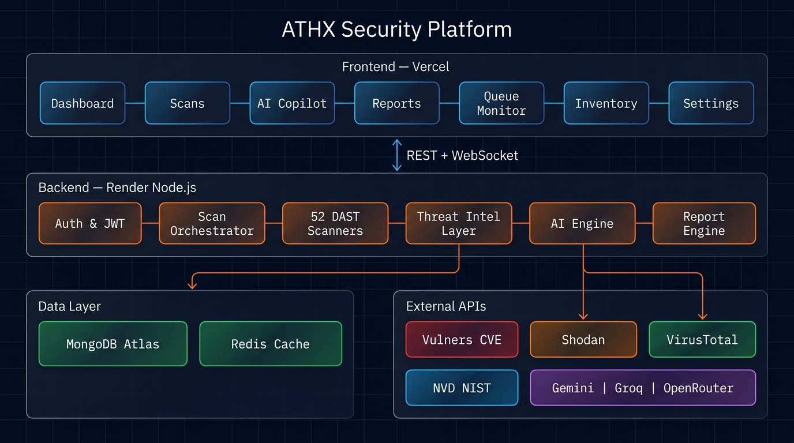
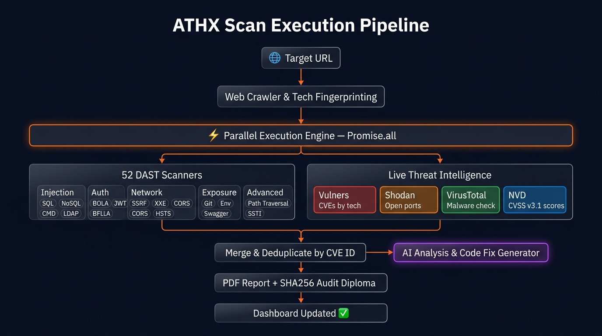
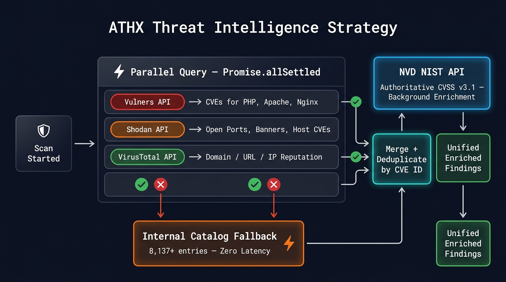

<div align="center">


# ATHX Security — Enterprise AI API Security Platform

**_"Find. Understand. Fix. Before attackers do."_**

[](https://api-security-scanner-mauve.vercel.app)
[](https://api-security-scanner-puum.onrender.com)
[](https://github.com/Redkrossresearch/api-security-scanner)

[](https://react.dev/)
[](https://vite.dev/)
[](https://nodejs.org/)
[](https://www.mongodb.com/)
[](https://bullmq.io/)
[](https://socket.io/)
[](https://ai.google.dev/)

</div>

---

## 🎯 Main Mission

> **ATHX Security is an autonomous, AI-powered API security platform that scans any web application for vulnerabilities, enriches findings with live threat intelligence, and delivers AI-generated fixes — all in real time.**

Most security tools tell you *what* is broken. ATHX tells you **what it is, how severe it is, where it came from, and exactly how to fix it** — with code patches, compliance mappings, and cryptographic audit reports ready to share.

---

## 🏗️ System Architecture



> Full-stack platform — React 19 frontend on Vercel communicates with Node.js/Express backend on Render via REST + WebSocket. Backend orchestrates 52 DAST scanners, live threat intelligence APIs (Vulners, Shodan, VirusTotal, NVD), AI engine (Gemini/Groq), and persists everything to MongoDB Atlas.

---

## 🔄 Scan Execution Pipeline



> From URL input to enriched findings: web crawler fingerprints the tech stack → 52 DAST scanners + threat intel APIs fire in parallel → results merged and deduplicated by CVE ID → AI generates code fixes → PDF audit report with SHA256 seal.

---

## 🌐 Threat Intelligence Strategy



> Vulners, Shodan, and VirusTotal queried in parallel via `Promise.allSettled`. If any source times out → zero-latency fallback to the internal 8,137-entry catalog. NVD NIST provides authoritative CVSS v3.1 scores for all CVEs in the background — overriding both catalog and source scores.

---

## ✨ Full Feature Breakdown

### 🛡️ 1. 52-Scanner Parallel DAST Engine

The core of ATHX — **52 specialized Dynamic Application Security Testing probes** running concurrently via `Promise.all`. Every probe fires real HTTP requests against the target.

| Category | Scanners |
|---|---|
| **Injection** | SQL Injection, NoSQL Injection, Command Injection, LDAP Injection, XPath Injection, SSTI |
| **Auth & Access** | BOLA/IDOR, BFLA, JWT Weak Secret, JWT Algorithm Confusion, OAuth Misconfiguration |
| **Headers & Config** | CORS, CSP Eval, HSTS, Clickjacking, Referrer Policy, Content-Type Sniffing |
| **Data Exposure** | Server Header Disclosure, Env File Exposure, Git Exposure, Swagger Exposure |
| **Injection Advanced** | SSRF, XXE, Path Traversal, HTTP Smuggling, Mass Assignment, Prototype Pollution |
| **Network** | SSL/TLS Config, Redis Exposure, Cloud Metadata, Subdomain Takeover, Rate Limiting |
| **API Specific** | GraphQL Introspection, gRPC Security, WebSockets, API Versioning, Cookie Security |
| **Discovery** | Attack Surface Mapping, Endpoint Risk Scoring, Directory Bruteforce, Tech Fingerprinting |

```
Every finding includes:
  ✔ CVSS 3.1 Base Score
  ✔ CWE + OWASP Top 10 mapping
  ✔ Severity: Critical / High / Medium / Low / Info
  ✔ AI-generated code fix
  ✔ Step-by-step remediation
```

---

### 🌐 2. Live Threat Intelligence Integration

| Source | What it does | Fallback |
|---|---|---|
| 🔴 **Vulners** | CVEs for detected tech (PHP, Apache, Nginx...) | Catalog |
| 🟠 **Shodan** | Open ports, exposed services, host-level CVEs | Catalog |
| 🟢 **VirusTotal** | Domain/URL/IP malware & reputation (70+ engines) | Catalog |
| 🔵 **NVD NIST** | Authoritative CVSS v3.1 for every CVE (background) | — |
| 📁 **Internal Catalog** | 8,137+ entries — instant, always available | Primary fallback |

**New Endpoints:**
```
POST /api/threat-intel/scan           → Full scan all sources
GET  /api/threat-intel/cve/:cveId    → NVD CVE details + CVSS v3.1
GET  /api/threat-intel/shodan/:host  → Shodan open ports + CVEs
GET  /api/threat-intel/virustotal/:t → VirusTotal domain/IP scan
GET  /api/threat-intel/vulners/:sw   → Vulners CVE search by software
```

---

### 🧠 3. Multi-Agent AI Security Copilot

```
User Query → RAG Vector Store (past scans + catalog)
           → DAG Knowledge Graph (OWASP / CWE taxonomy)
           → Live Web Search (latest CVEs & zero-days)
           → AI Critic Evaluator (self-quality check)
           → LLM: Gemini Flash / Groq LPU / OpenRouter
           → Code patch + citation cards + attack diagram
```

**Capabilities:**
- 💬 Natural language Q&A on any vulnerability
- 🔧 Drop-in Node.js / Express security patches with before/after diffs
- 📎 Clickable citation cards from NIST, OWASP, CVE databases
- 🖼️ Attack diagram generation
- 🧠 Learns from your previous scan history via RAG

---

### 📊 4. Real-Time Dashboard & Telemetry

Live KPIs — Total Scans · Active Threats · Critical CVEs · Compliance Score  
7-day & 30-day vulnerability trend charts · Live threat feed · Attack origin map  
All updated in real time via **Socket.IO WebSocket** events.

---

### ⚡ 5. BullMQ Worker Queue Monitor (`/queue`)

- **8-slot Worker Thread Pool** — `IDLE / PROCESSING / FAILED` per slot
- **Live Terminal Stream** — `scan:start` → `scan:progress` → `scan:completed`
- **Job Diagnostics Drawer** — raw payload, error stack trace, 1-click Re-Queue
- **CSV Export** — full queue metrics and job history

---

### 🗂️ 6. API Inventory & Endpoint Discovery (`/inventory`)

JavaScript bundle AST parsing → hidden route extraction → host grouping  
Risk badges (`CRITICAL / HIGH / MEDIUM / LOW`) per endpoint  
**1-click OpenAPI 3.0 JSON export** for discovered inventory

---

### 📜 7. Reports & Cryptographic Audit Diplomas

| Format | Contents |
|---|---|
| **PDF** | Executive summary, CVSS breakdown, attack diagrams, compliance scores |
| **DOCX** | Word-compatible security audit report |
| **CSV** | Tabular vulnerability data for spreadsheet analysis |
| **JSON / YAML** | Machine-readable findings for CI/CD pipelines |
| **ZIP** | All formats bundled |
| **Diploma** | Printable certificate with **SHA256 seal + HMAC digital signature** |

---

### ⚙️ 8. Settings & Theme Engine (`/settings`)

| Category | Settings |
|---|---|
| **Profile** | `username`, `email`, `avatarUrl`, `orgHandle` |
| **Appearance** | `themeMode` (4 themes), `accentColor`, `compactMode`, `soundEnabled` |
| **Scanner** | `crawlDepth`, `rateLimit`, `subdomainDiscovery`, `piiMasking` |
| **Security** | `twoFactorAuth`, `webhookUrl`, `logRetentionDays` |

Theme change → emits `athx-settings-updated` → CSS root variables mutate site-wide **instantly without page reload.**

---

## 📡 Complete API Reference

### 🔐 Auth
| Method | Endpoint | Description |
|---|---|---|
| `POST` | `/api/auth/google-login` | Google OAuth → JWT exchange |
| `POST` | `/api/auth/register` | Email/password registration |
| `POST` | `/api/auth/login` | Email/password login |
| `POST` | `/api/auth/logout` | Invalidate session |

### 🔍 Scans
| Method | Endpoint | Description |
|---|---|---|
| `POST` | `/api/scans/start` | Launch 52-scanner parallel DAST audit |
| `GET` | `/api/scans` | List all scans with status |
| `GET` | `/api/scans/:id` | Full scan detail — findings, CVSS, telemetry |
| `POST` | `/api/scans/:id/reaudit` | Re-queue existing scan |
| `DELETE` | `/api/scans/:id` | Delete scan record |

### 🌐 Threat Intelligence
| Method | Endpoint | Description |
|---|---|---|
| `POST` | `/api/threat-intel/scan` | Full scan — all sources + catalog + NVD enrichment |
| `GET` | `/api/threat-intel/cve/:cveId` | NVD official CVE + CVSS v3.1 |
| `GET` | `/api/threat-intel/shodan/:host` | Shodan open ports + host CVEs |
| `GET` | `/api/threat-intel/virustotal/:target` | VirusTotal domain/URL/IP reputation |
| `GET` | `/api/threat-intel/vulners/:software` | Vulners CVE search by software |

### 🧠 AI & Copilot
| Method | Endpoint | Description |
|---|---|---|
| `POST` | `/api/ai/analyze` | AI vulnerability analysis + code fix |
| `POST` | `/api/ai/export-pdf` | Generate PDF for a vulnerability |
| `POST` | `/api/copilot/chat` | RAG AI copilot conversation |

### 🗂️ Inventory
| Method | Endpoint | Description |
|---|---|---|
| `POST` | `/api/inventory/scan-target` | Crawl target → discover endpoints via JS AST |
| `GET` | `/api/inventory` | List all discovered endpoints |
| `GET` | `/api/inventory/export` | Export OpenAPI 3.0 JSON spec |

### ⚙️ Settings & Other
| Method | Endpoint | Description |
|---|---|---|
| `GET/PUT` | `/api/settings` | Fetch / update 15 persistent settings |
| `GET` | `/api/queue/status` | BullMQ worker pool metrics |
| `GET` | `/api/dashboard/stats` | Dashboard KPI data |
| `GET` | `/api/reports/:id/pdf` | Generate executive PDF report |

---

## 🗂️ Project Structure

```
api-security-scanner/
├── backend/
│   ├── src/
│   │   ├── modules/
│   │   │   ├── ai/              # AI analysis, Gemini/Groq adapters
│   │   │   ├── agents/          # Autonomous agent roster (Planner, Fixer, Judge)
│   │   │   ├── auth/            # JWT, Google OAuth, RBAC middleware
│   │   │   ├── copilot/         # RAG conversation controller
│   │   │   ├── engines/         # CVSS engine, Risk engine, Severity engine
│   │   │   ├── inventory/       # JS AST crawler, endpoint discovery, OpenAPI export
│   │   │   ├── llm/             # RAG vector store, reranker, DAG graph
│   │   │   ├── queue/           # BullMQ worker status + diagnostics
│   │   │   ├── reports/         # PDF/DOCX/CSV report builder + crypto certs
│   │   │   ├── scanner/         # ← 52 DAST scanner modules
│   │   │   ├── scans/           # Scan orchestration, attack graph, WebSocket
│   │   │   ├── settings/        # 15-field settings schema + MongoDB persistence
│   │   │   ├── threat-intel/    # ← Vulners, NVD, Shodan, VirusTotal services
│   │   │   └── vulnerabilities/ # 8,137+ entry vuln catalog + factory
│   │   ├── middleware/          # Rate limiter, request logger, auth
│   │   └── sockets/             # Socket.IO server for real-time events
│   └── server.js
├── frontend/
│   ├── src/
│   │   ├── components/          # Dashboard, Scans, Copilot, Layouts, AI panels
│   │   ├── pages/               # All route pages
│   │   ├── services/            # Axios client (120s timeout, Vercel auto-fallback)
│   │   └── sockets/             # Socket.IO client + ConnectionStatus badge
│   └── index.html               # Custom ATHX favicon
├── docs/
│   └── diagrams/                # Architecture, Pipeline, Threat Intel diagrams
├── collaboration_log.md         # Full 224-commit sprint registry
└── README.md
```

---

## 🛠️ Local Setup

### Prerequisites
- Node.js v20+ · MongoDB · Redis *(optional)*

### 1. Clone
```bash
git clone https://github.com/Redkrossresearch/api-security-scanner.git
cd api-security-scanner
```

### 2. Backend
```bash
cd backend && npm install
```

`backend/.env`:
```env
NODE_ENV=development
PORT=5000
MONGODB_URI=mongodb://localhost:27017/api-security-scanner
JWT_ACCESS_SECRET=your_secret
JWT_REFRESH_SECRET=your_refresh_secret
CLIENT_URL=http://localhost:5173
GEMINI_API_KEY=your_key
GROQ_API_KEY=your_key
OPENROUTER_API_KEY=your_key
VULNERS_API_KEY=your_key
NVD_API_KEY=your_key
SHODAN_API_KEY=your_key
VIRUSTOTAL_API_KEY=your_key
THREAT_INTEL_TIMEOUT_MS=8000
```

```bash
npm run dev   # → http://localhost:5000
```

### 3. Frontend
```bash
cd frontend && npm install && npm run dev   # → http://localhost:5173
```

---

## 🛠️ Tech Stack

| Layer | Technology |
|---|---|
| **Frontend** | React 19, Vite 8, React Router 7, Framer Motion, ReactFlow |
| **Backend** | Node.js 24, Express 5, Socket.IO |
| **Database** | MongoDB Atlas + Mongoose |
| **Task Queue** | BullMQ + Redis (in-process fallback) |
| **Auth** | Firebase Google OAuth + Backend JWT + RBAC |
| **AI** | Google Gemini Flash, Groq LPU, OpenRouter |
| **Threat Intel** | Vulners, NVD NIST, Shodan, VirusTotal |
| **Reports** | PDFKit, Puppeteer, SHA256 + HMAC |
| **Deployment** | Vercel (frontend) + Render (backend) |

---

## 👥 Team

| Member | Role | Branch |
|---|---|---|
| **Atharv Gupta** | Backend Architecture · 52 Scanners · AI Engine · Threat Intel · BullMQ · Auth · Reports · DevOps | `atharv-dev` |
| **Muskan** | Frontend UI/UX · React Components · Dashboard · Settings · Inventory · Copilot Chat · Design System | `muskan-dev` |

**Total Commits: 224+** across `main` · `dev` · `atharv-dev` · `muskan-dev`  
Full sprint history → [collaboration_log.md](./collaboration_log.md)

---

## ⚖️ License

Copyright © 2024–2026 **Atharv Gupta & Muskan** — Redkross Research / ATHX Security Platform.  
All Rights Reserved. Proprietary software — unauthorized use or distribution is strictly prohibited.
