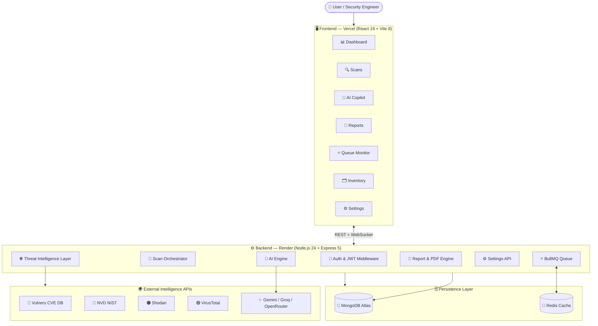
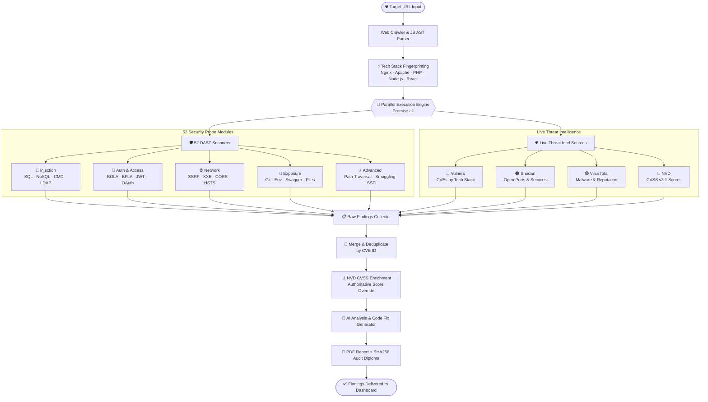
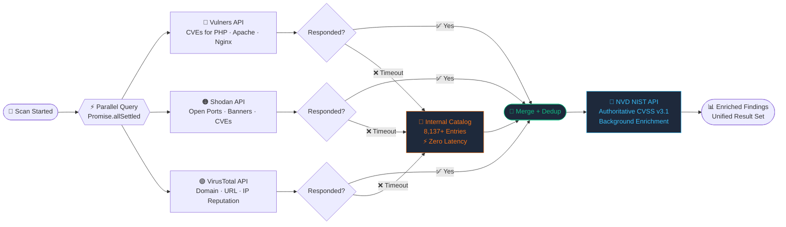
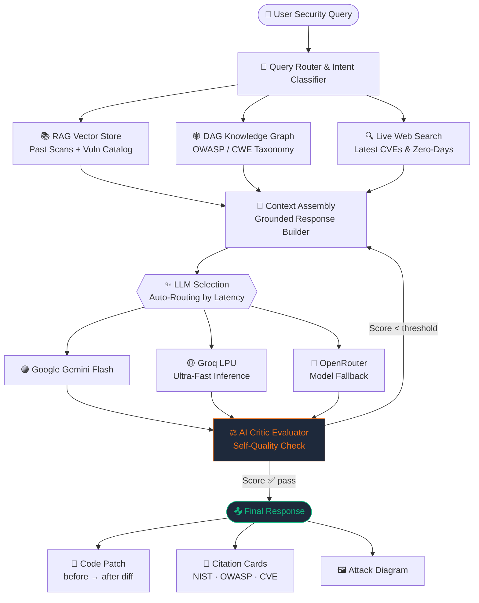
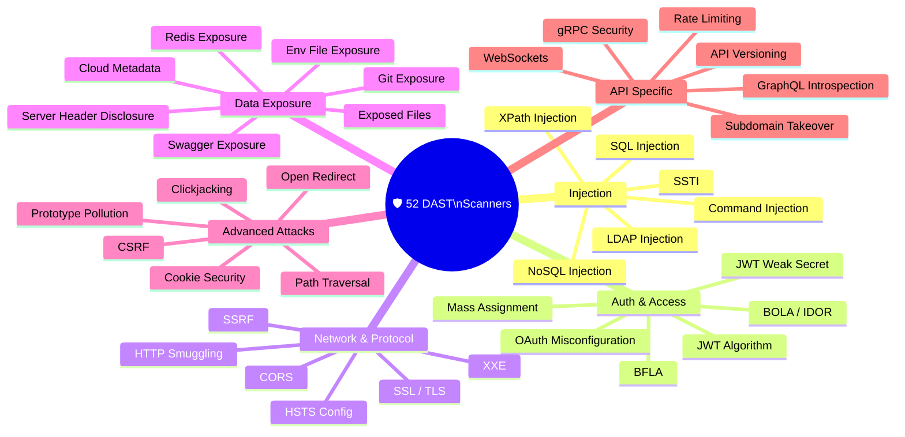
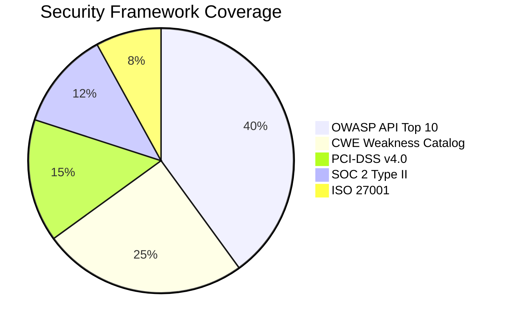
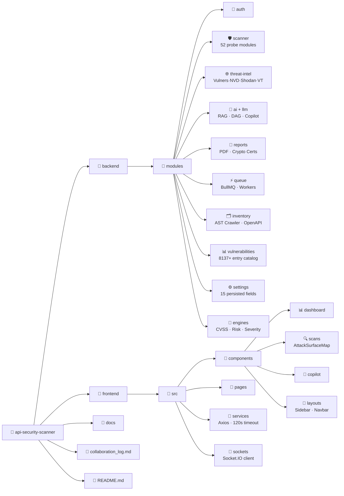
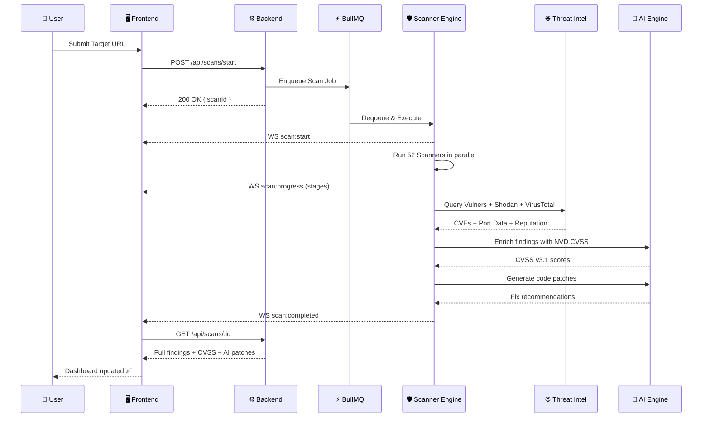
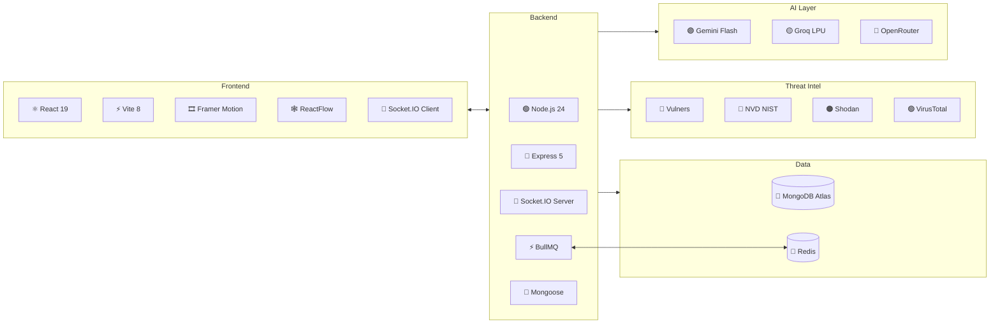

<div align="center">


# ATHX Security — Enterprise AI API Security Platform

**_"Find. Understand. Fix. Before attackers do."_**

[](https://api-security-scanner-mauve.vercel.app)
[](https://api-security-scanner-puum.onrender.com)
[](https://github.com/Redkrossresearch/api-security-scanner)

[](https://react.dev/)
[](https://vite.dev/)
[](https://nodejs.org/)
[](https://www.mongodb.com/)
[](https://bullmq.io/)
[](https://socket.io/)
[](https://ai.google.dev/)

</div>

---

## 🎯 Main Mission

> **ATHX Security is an autonomous, AI-powered API security platform that scans any web application for vulnerabilities, enriches findings with live threat intelligence, and delivers AI-generated fixes — all in real time.**

Most security tools tell you *what* is broken. ATHX tells you **what it is, how severe it is, where it came from, and exactly how to fix it** — with code patches, compliance mappings, and cryptographic audit reports ready to share.

Built for developers, security engineers, and DevSecOps teams who need deep API security without a six-figure enterprise contract.

---

## 🏗️ System Architecture



---

## 🔄 Scan Execution Pipeline



---

## 🌐 Threat Intelligence Strategy



---

## 🧠 AI Copilot Pipeline



---

## 🛡️ 52-Scanner DAST Engine



---

## 📊 Compliance Framework Coverage



---

## 🗂️ Project Structure



---

## 🚀 Scan Lifecycle & WebSocket Events



---

## 📡 Complete API Reference

### 🔐 Auth
| Method | Endpoint | Description |
|---|---|---|
| `POST` | `/api/auth/google-login` | Google OAuth → JWT token exchange |
| `POST` | `/api/auth/register` | Email/password registration |
| `POST` | `/api/auth/login` | Email/password login |
| `POST` | `/api/auth/logout` | Invalidate session |

### 🔍 Scans
| Method | Endpoint | Description |
|---|---|---|
| `POST` | `/api/scans/start` | Launch 52-scanner parallel DAST audit |
| `GET` | `/api/scans` | List all scans with status |
| `GET` | `/api/scans/:id` | Full scan detail (findings, CVSS, telemetry) |
| `POST` | `/api/scans/:id/reaudit` | Re-queue existing scan |
| `DELETE` | `/api/scans/:id` | Delete scan record |

### 🌐 Threat Intelligence _(New)_
| Method | Endpoint | Description |
|---|---|---|
| `POST` | `/api/threat-intel/scan` | Full scan — all sources + catalog + NVD enrichment |
| `GET` | `/api/threat-intel/cve/:cveId` | NVD official CVE details + CVSS v3.1 |
| `GET` | `/api/threat-intel/shodan/:host` | Shodan open ports + host CVEs |
| `GET` | `/api/threat-intel/virustotal/:target` | VirusTotal domain/URL/IP reputation |
| `GET` | `/api/threat-intel/vulners/:software` | Vulners CVE search by software name |

### 🧠 AI & Copilot
| Method | Endpoint | Description |
|---|---|---|
| `POST` | `/api/ai/analyze` | AI vulnerability analysis + code fix |
| `POST` | `/api/ai/export-pdf` | Generate PDF for a vulnerability |
| `POST` | `/api/copilot/chat` | RAG AI copilot conversation |

### 🗂️ Inventory
| Method | Endpoint | Description |
|---|---|---|
| `POST` | `/api/inventory/scan-target` | Crawl target → discover endpoints via JS AST |
| `GET` | `/api/inventory` | List all discovered endpoints |
| `GET` | `/api/inventory/export` | Export OpenAPI 3.0 JSON spec |

### ⚙️ Settings & Other
| Method | Endpoint | Description |
|---|---|---|
| `GET` | `/api/settings` | Fetch 15 persistent settings |
| `PUT` | `/api/settings` | Update and persist settings |
| `GET` | `/api/queue/status` | BullMQ worker pool metrics |
| `GET` | `/api/dashboard/stats` | Dashboard KPI data |
| `GET` | `/api/reports/:id/pdf` | Generate executive PDF report |

---

## ✨ Feature Summary

| Feature | Details |
|---|---|
| **52-Scanner DAST Engine** | Parallel `Promise.all` execution, CVSS 3.1, CWE/OWASP mapped |
| **Live Threat Intel** | Vulners + Shodan + VirusTotal + NVD, catalog fallback (zero latency) |
| **AI Security Copilot** | RAG + DAG + Web Search, Gemini / Groq / OpenRouter, code patches |
| **Real-Time WebSockets** | Live scan progress, worker pool events via Socket.IO |
| **BullMQ Worker Queue** | 8-thread pool, re-queue, CSV export, live terminal stream |
| **API Inventory Discovery** | JS AST crawling, host grouping, OpenAPI 3.0 export |
| **6-Format Report Export** | PDF · DOCX · CSV · JSON · YAML · ZIP |
| **Cryptographic Diplomas** | SHA256 seal + HMAC signature on audit certificates |
| **Compliance Radar** | OWASP API Top 10 · PCI-DSS v4.0 · SOC 2 Type II · ISO 27001 |
| **Settings Engine** | 15 MongoDB settings, 4 themes, site-wide CSS bus, Web Audio synth |
| **Attack Surface Map** | ReactFlow interactive vulnerability graph |
| **Multi-Framework Auth** | Firebase Google OAuth + JWT + RBAC roles |

---

## 🛠️ Local Setup

### Prerequisites
- Node.js v20+
- MongoDB (local or Atlas)
- Redis *(optional — for BullMQ multi-worker mode)*

### 1. Clone
```bash
git clone https://github.com/Redkrossresearch/api-security-scanner.git
cd api-security-scanner
```

### 2. Backend
```bash
cd backend
npm install
```

Create `backend/.env`:
```env
NODE_ENV=development
PORT=5000

MONGODB_URI=mongodb://localhost:27017/api-security-scanner

JWT_ACCESS_SECRET=your_secret
JWT_REFRESH_SECRET=your_refresh_secret

CLIENT_URL=http://localhost:5173

GEMINI_API_KEY=your_gemini_key
GROQ_API_KEY=your_groq_key
OPENROUTER_API_KEY=your_openrouter_key

# Threat Intelligence APIs
VULNERS_API_KEY=your_vulners_key
NVD_API_KEY=your_nvd_key
SHODAN_API_KEY=your_shodan_key
VIRUSTOTAL_API_KEY=your_virustotal_key
THREAT_INTEL_TIMEOUT_MS=8000
```

```bash
npm run dev
# → http://localhost:5000
```

### 3. Frontend
```bash
cd frontend
npm install
npm run dev
# → http://localhost:5173
```

---

## 🛠️ Tech Stack



---

## 👥 Team

| Member | Role | Branch |
|---|---|---|
| **Atharv Gupta** | Backend Architecture · 52 Scanners · AI Engine · Threat Intel · BullMQ · Auth · Reports · DevOps | `atharv-dev` |
| **Muskan** | Frontend UI/UX · React Components · Dashboard · Settings · Inventory · Copilot Chat · Design System | `muskan-dev` |

**Total Commits: 224+** across `main` · `dev` · `atharv-dev` · `muskan-dev`

See [collaboration_log.md](./collaboration_log.md) for the complete sprint history and contribution breakdown.

---

## ⚖️ License

Copyright © 2024–2026 **Atharv Gupta & Muskan** — Redkross Research / ATHX Security Platform.
All Rights Reserved. Proprietary software — unauthorized use, copying, or distribution is strictly prohibited.
