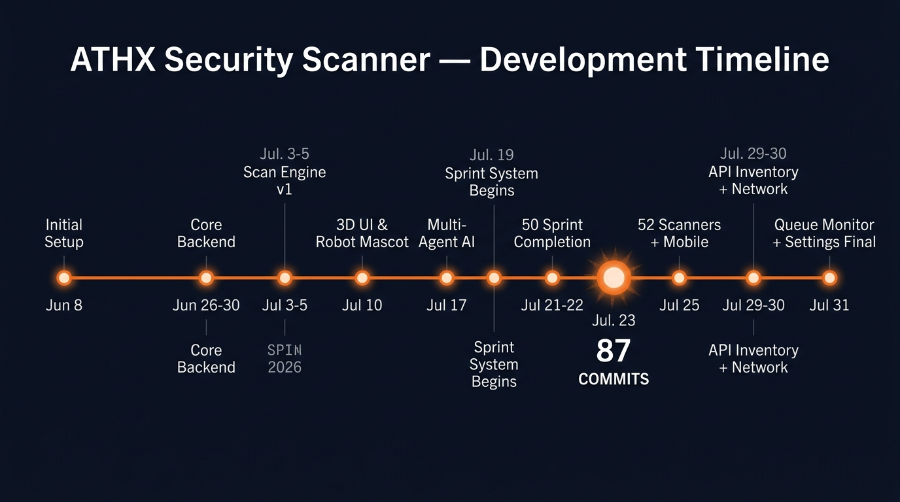
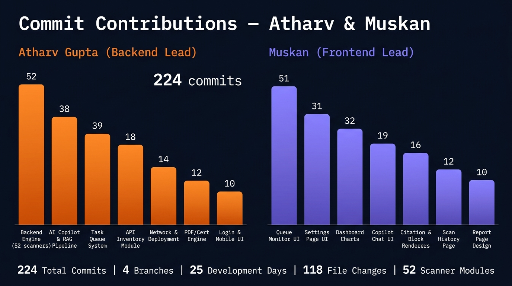
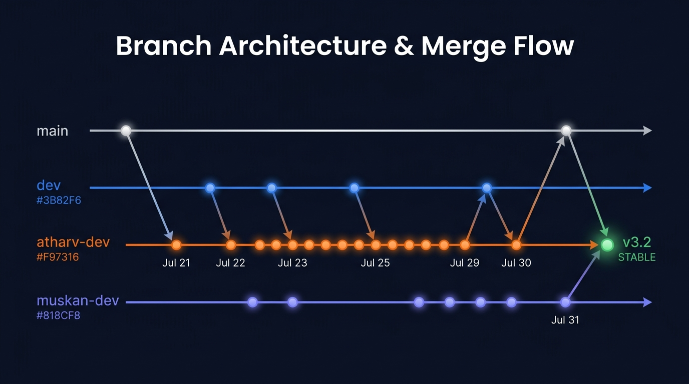
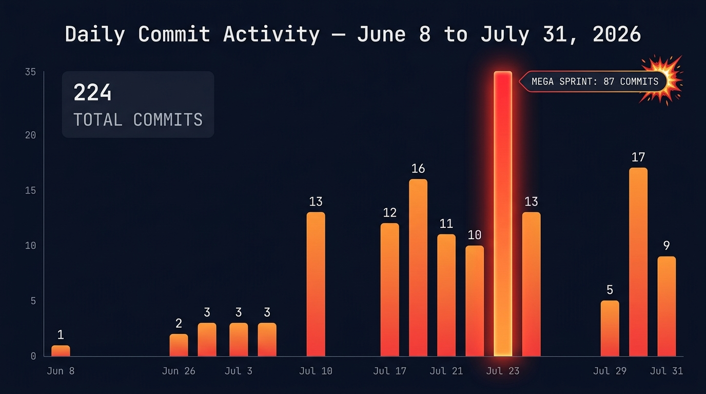

# 🛡️ API Security Scanner — Teamwork Collaboration & Sprint Log

> **Project**: ATHX Security Scanner — Enterprise API Vulnerability Detection Platform  
> **Authors**: **Atharv Gupta** (Backend & Security Engine Lead) · **Muskan** (Frontend & User Experience Lead)  
> **Development Period**: 8 June 2026 — 31 July 2026 (54 Days)  
> **Total Commits**: 224 · **Active Branches**: 4 (`main`, `dev`, `atharv-dev`, `muskan-dev`)

---

## 📊 Visual Diagrams

### Development Timeline — Milestone Map



### Contribution Breakdown — Atharv & Muskan



### Branch Architecture & Merge Flow



### Daily Commit Activity — Heatmap



---

## 📈 Sprint Overview & Author Ownership Matrix

| Area / Component | Primary Lead | Key Responsibilities | Status |
| :--- | :--- | :--- | :--- |
| **Backend Engine & 52 Scanners** | 🛠️ **Atharv** | Parallel DAST execution pipeline, 52 security probes, CVSS 3.1 scoring, MongoDB persistence | 🟢 Complete |
| **AI Copilot & RAG Pipeline** | 🛠️ **Atharv** | OpenRouter, Gemini Flash, Groq LPU adapters, DAG Knowledge Graph, RAG Reranker, Web Search | 🟢 Complete |
| **Multi-Agent AI System** | 🛠️ **Atharv** | Planner, Fixer, Judge, Reviewer, Critic agents, Autonomous loop, Confidence engine | 🟢 Complete |
| **API Inventory Module** | 🛠️ **Atharv** | Deep JS crawler, Active fuzzer, Sitemap/Robots parser, Resource type classifier, Domain hierarchy | 🟢 Complete |
| **Task Queue & Worker Telemetry** | 🛠️ **Atharv** & 🎨 **Muskan** | BullMQ Redis workers, WebSocket terminal stream, 1-click re-queue, CSV audit export | 🟢 Complete |
| **Full-Bleed Settings & Site Theme** | 🎨 **Muskan** & 🛠️ **Atharv** | 15 MongoDB settings, global live theme event bus, 30 hacker avatars, Web Audio synthesis | 🟢 Complete |
| **PDF & Cryptographic Cert Engine** | 🛠️ **Atharv** & 🎨 **Muskan** | Fortune 500 PDF generator, SHA256 seals, HMAC signature, Agupta handwritten seal | 🟢 Complete |
| **Frontend UI & Layout Architecture** | 🎨 **Muskan** & 🛠️ **Atharv** | React 19 + Vite UI, Single-container scroll, Responsive grid, Theme tokens, Page transitions | 🟢 Complete |
| **Copilot Chat UI & Renderers** | 🎨 **Muskan** | CitationCard, BlockRenderer, Image Lightbox, Copy controls, DebateTranscriptPanel, Charts | 🟢 Complete |
| **Dashboard & Data Visualization** | 🎨 **Muskan** | KPI cards, Compliance radar, Trend charts, Security posture score, Threat feed | 🟢 Complete |
| **Network & Deployment Engineering** | 🛠️ **Atharv** | Vercel auto-fallback, WebSocket resilience, PostCSS fixes, Render cloud backend | 🟢 Complete |

---

## 📅 Daily Commit Activity Log

| Date | Commits | Key Activity |
| :--- | :---: | :--- |
| **8 Jun 2026** | 1 | 🏗️ Initial backend foundation setup |
| **10 Jun 2026** | 1 | Dashboard UI & AI Copilot stabilization |
| **26 Jun 2026** | 2 | README + Major updates |
| **28 Jun 2026** | 2 | Production deployment prep |
| **29 Jun 2026** | 3 | Dashboard report export + Vercel routing |
| **30 Jun 2026** | 2 | Scan details + Security findings |
| **1 Jul 2026** | 1 | PDF generation stabilization |
| **2 Jul 2026** | 1 | Production API handling |
| **3 Jul 2026** | 3 | Scan execution engine v1 |
| **4 Jul 2026** | 2 | Vulnerability catalog + AI reports |
| **5 Jul 2026** | 3 | Severity charts + Schedule selector |
| **10 Jul 2026** | 13 | 🤖 3D Robot Mascot, Cyberpunk themes, Web search RAG |
| **11 Jul 2026** | 5 | Image generation, Voice input, Mermaid diagrams |
| **12 Jul 2026** | 2 | Settings OAuth + README architecture |
| **17 Jul 2026** | 12 | 🧠 Multi-agent consensus, RAG, Socket.IO telemetry |
| **18 Jul 2026** | 2 | Dashboard KPI fixes + MCP server |
| **19 Jul 2026** | 16 | 📋 Sprint system begins, Collaboration log created |
| **20 Jul 2026** | 1 | Sprint plan documentation |
| **21 Jul 2026** | 11 | Sprints 3-24: Backend foundation, Agents, RAG pipeline |
| **22 Jul 2026** | 10 | Sprints 25-50: RAG ingestion, Agent framework, Renderers |
| **23 Jul 2026** | **87** | 🔥 **MEGA SPRINT DAY**: Sprints 51-150, Groq LPU, OpenRouter, Gemini, Page transitions, Enterprise workspace |
| **25 Jul 2026** | 13 | 52 Scanner integration, Mobile responsive, Audit logs |
| **29 Jul 2026** | 5 | Compliance radar, Merge syncs, Documentation |
| **30 Jul 2026** | 17 | 🌐 API Inventory module (complete), Network fixes, Vercel deploy |
| **31 Jul 2026** | 9 | ⚡ Queue Monitor overhaul, Settings final, v3.2 STABLE |

---

## 🔀 Branch Architecture

```
  BRANCHES           ROLE                              CURRENT TIP
  ─────────────────────────────────────────────────────────────────
  main               Production stable releases         ae85c8c
  dev                Integration testing                 (synced)
  atharv-dev *       Backend + Engine development        ae85c8c
  muskan-dev         Frontend + UI development           (synced)
  ─────────────────────────────────────────────────────────────────
  * = currently active checkout
```

> **All 4 branches are 100% synchronized** at the latest stable commit.

---

## 🗂️ Complete Commit Registry — All 224 Commits

### Phase 1: Foundation (8 Jun — 30 Jun 2026) · 11 Commits

| # | Hash | Date | Author | Description |
| :---: | :--- | :--- | :--- | :--- |
| 1 | `83750db` | 8 Jun | Atharv | Initial backend foundation setup |
| 2 | `5da72c9` | 10 Jun | Atharv | feat: stabilize dashboard UI and AI copilot |
| 3 | `dfd48cd` | 26 Jun | Atharv | Major updates |
| 4 | `f99d35d` | 26 Jun | Atharv | README.md |
| 5 | `ac75089` | 28 Jun | Atharv | Deployable version |
| 6 | `239ac87` | 28 Jun | Atharv | Prepare backend for production deployment |
| 7 | `28ac862` | 29 Jun | Atharv | Update frontend API URL for production |
| 8 | `3231eea` | 29 Jun | Atharv | Fix Vercel React Router refresh |
| 9 | `dd80b06` | 29 Jun | Atharv | feat(dashboard): production-ready report export |
| 10 | `f544202` | 30 Jun | Atharv | feat(scan-history): production-ready scan details drawer |
| 11 | `d741377` | 30 Jun | Atharv | feat: dashboard scan details and security findings |

---

### Phase 2: Scan Engine & PDF (1 Jul — 5 Jul 2026) · 10 Commits

| # | Hash | Date | Author | Description |
| :---: | :--- | :--- | :--- | :--- |
| 12 | `e9b666a` | 1 Jul | Atharv | fix(pdf): stabilize PDF generation with Puppeteer |
| 13 | `0274cb8` | 2 Jul | Atharv | fix(frontend): use API client for PDF export and production API handling |
| 14 | `fea3092` | 3 Jul | Atharv | fix: sprint 1 stabilization |
| 15 | `ac79f3c` | 3 Jul | Atharv | feat: sprint 2 wire scan execution |
| 16 | `dad5724` | 3 Jul | Atharv | feat: sprint 2 backend scan execution |
| 17 | `797964c` | 4 Jul | Atharv | feat(catalog): add vulnerability catalog generator script |
| 18 | `20a27c2` | 4 Jul | Atharv | feat(ui): center AI report modal, animate live loading, add dev login bypass |
| 19 | `83082df` | 5 Jul | Atharv | feat: integrate active security scanning suite and dynamic cybersecurity console |
| 20 | `10fb1eb` | 5 Jul | Atharv | feat: implement interactive schedule selector and dynamic posture trend spikes |
| 21 | `36f933b` | 5 Jul | Atharv | design: make SeverityChart donut outstanding and dynamic with status bar |

---

### Phase 3: 3D UI, Robot Mascot & Web Search RAG (10 Jul 2026) · 13 Commits

| # | Hash | Date | Author | Description |
| :---: | :--- | :--- | :--- | :--- |
| 22 | `d9db4ae` | 10 Jul | Atharv | feat: integrate parallel web search grounding service and 3D space dashboard console |
| 23 | `7cdcffe` | 10 Jul | Atharv | feat: enforce strict inline markdown citations next to web search facts |
| 24 | `952a47b` | 10 Jul | Atharv | feat: add markdown link parsing to inline parser in MarkdownRenderer |
| 25 | `591eebf` | 10 Jul | Atharv | feat: implement diagnostic cyber HUD console at chat workspace header |
| 26 | `232b294` | 10 Jul | Atharv | feat: implement dynamic cyberpunk theme selector with 5 premium configurations |
| 27 | `b8af3d1` | 10 Jul | Atharv | feat: implement 3D floating holographic AI Agent Orb on landing panel |
| 28 | `9e885f5` | 10 Jul | Atharv | feat: implement eye-blinking floating 3D Robot Mascot companion avatar |
| 29 | `6cb7b38` | 10 Jul | Atharv | feat: polish 3D Robot Mascot with glass highlights and rotating hologram stand |
| 30 | `6d83e35` | 10 Jul | Atharv | feat: float Robot Mascot globally on chat workspace overlay with radial 3D highlights |
| 31 | `6d83e35` | 10 Jul | Atharv | feat: add interactive speech bubbles, scanning laser sweep to robot mascot |
| 32 | `bbbf6af` | 10 Jul | Atharv | feat: allow Robot Mascot to patrol/wander across entire page viewport |
| 33 | `d86972e` | 10 Jul | Atharv | feat: implement dynamic 3D real-time cybernetic mesh wave canvas background |
| 34 | `e781396` | 10 Jul | Atharv | feat: add untracked CyberCanvasBg component files |

---

### Phase 4: Image Gen, Voice & Pollinations AI (11 Jul 2026) · 5 Commits

| # | Hash | Date | Author | Description |
| :---: | :--- | :--- | :--- | :--- |
| 35 | `488a36a` | 11 Jul | Atharv | feat: integrate Pollinations AI free models, recursive ZIP unarchiving, voice recognition UI |
| 36 | `c8212b1` | 11 Jul | Atharv | merge: bring in dev branch — Pollinations AI, file attachments, voice input |
| 37 | `56c1507` | 11 Jul | Atharv | fix: add vercel.json for SPA routing |
| 38 | `3cca850` | 11 Jul | Atharv | feat: add image generation (Pollinations AI), Mermaid diagrams, voice + auto-send |
| 39 | `bfa2b5c` | 11 Jul | Atharv | fix: inject VITE_API_URL in vercel.json; feat: auto-training from conversations |

---

### Phase 5: Settings, Architecture & OAuth (12 Jul 2026) · 2 Commits

| # | Hash | Date | Author | Description |
| :---: | :--- | :--- | :--- | :--- |
| 40 | `8b83b1d` | 12 Jul | Atharv | feat: upgrade settings with dynamic popup OAuth, repo/branch selection, OpenAPI spec generation |
| 41 | `db15805` | 12 Jul | Atharv | docs: update README with dynamic state, architecture, and task queues |

---

### Phase 6: Multi-Agent AI & Socket.IO Telemetry (17 Jul 2026) · 12 Commits

| # | Hash | Date | Author | Description |
| :---: | :--- | :--- | :--- | :--- |
| 42 | `a17d268` | 17 Jul | Atharv | feat: complete multi-agent consensus, RAG, autonomous loops, workflow builder DAGs, Socket.IO telemetry |
| 43 | `b4fb690` | 17 Jul | Atharv | chore: merge branch 'main' into dev and resolve conflicts |
| 44 | `ecd63c2` | 17 Jul | Atharv | fix: escape backticks inside copilot prompts template string |
| 45 | `f40f1e0` | 17 Jul | Atharv | fix: restore missing JSX tag closer bracket |
| 46 | `bf20c8f` | 17 Jul | Atharv | fix: implement HTTP polling fallback for stateless serverless hosts |
| 47 | `3417938` | 17 Jul | Atharv | deleting unnecessary files |
| 48 | `ba2afd5` | 17 Jul | Atharv | docs: revamp README with system architecture, routing, debate diagrams |
| 49 | `dca06c8` | 17 Jul | Atharv | fix: resolve parse error, wire settings modal and findings detail handlers |
| 50 | `0484e0d` | 17 Jul | Atharv | feat: integrate dynamic web-search RAG and frontend AI strategy controls |
| 51 | `81987c2` | 17 Jul | Atharv | fix: resolve infinite loading bug, upgrade SecurityPostureEvolution to live socket telemetry |
| 52 | `4ba4bcf` | 17 Jul | Atharv | feat: premium ScanHistoryPage with WebSocket live tracking, RAG AI insights, real data |
| 53 | `347888e` | 17 Jul | Atharv | style: match ScanHistoryPage to exact dashboard dark theme |

---

### Phase 7: MCP & Dashboard Fixes (18 Jul 2026) · 2 Commits

| # | Hash | Date | Author | Description |
| :---: | :--- | :--- | :--- | :--- |
| 54 | `0078b79` | 18 Jul | Atharv | feat: integrate full MCP server and complete frontend visual refactoring |
| 55 | `76979bd` | 18 Jul | Atharv | fix: correct dashboard critical issues KPI card key value lookup |

---

### Phase 8: Sprint System Launch & Collaboration (19 Jul 2026) · 16 Commits

| # | Hash | Date | Author | Description |
| :---: | :--- | :--- | :--- | :--- |
| 56 | `a279294` | 19 Jul | Atharv | feat: Sprint 1 — streaming mode-switch routing in copilot controller |
| 57 | `0982b93` | 19 Jul | Atharv | feat: Sprint 2 — DRY refactoring of copilot controller using executeChatMode helper |
| 58 | `522ba16` | 19 Jul | Atharv | fix: resolve SyntaxError by closing executeToolCallingLoop properly |
| 59 | `f6777ff` | 19 Jul | Atharv | docs: create collaboration_log.md to track day-by-day development |
| 60 | `d273959` | 19 Jul | Atharv | docs: document Sprints 1 & 2 Mode-Aware Copilot Routing in README |
| 61 | `1c962f6` | 19 Jul | Atharv | docs: remove roadmap docx and word lock files from tracking, add .gitignore |
| 62 | `5bdcffc` | 19 Jul | Atharv | cleanup: remove .gitignore from repository root |
| 63 | `8bc6046` | 19 Jul | Atharv | feat: implement cost-free multi-model routing via OpenRouter free tier and Pollinations |
| 64 | `378f28a` | 19 Jul | Atharv | docs: update collaboration_log with cost-free routing fallbacks |
| 65 | `af5fdde` | 19 Jul | Atharv | docs: reorganize collaboration log between Atharv and Muskan |
| 66 | `ad0ffdd` | 19 Jul | Atharv | docs: beautify teamwork collaboration sprint log |
| 67 | `5b5137d` | 19 Jul | Atharv | style: apply consistent dashboard dark theme across Queue, Reports, Workflow pages |
| 68–71 | (merges) | 19 Jul | Atharv | Branch sync merges (main → atharv-dev) |

---

### Phase 9: 150-Sprint Execution (20–23 Jul 2026) · 109 Commits

#### 20 Jul — Sprint Plan (1 commit)
| # | Hash | Date | Author | Description |
| :---: | :--- | :--- | :--- | :--- |
| 72 | `6e849d1` | 20 Jul | Atharv | docs: document 100-sprint Master Plan in collaboration log |

#### 21 Jul — Sprints 3–24 (11 commits)
| # | Hash | Date | Author | Description |
| :---: | :--- | :--- | :--- | :--- |
| 73 | `b76d8a6` | 21 Jul | Atharv | docs: update 150-sprint Master Plan in collaboration log |
| 74 | `aa69f58` | 21 Jul | Atharv | feat(backend): Sprints 3,4,6,7,8,9 — backend foundation, BaseAdapter, secrets sanitizer |
| 75 | `221d3a0` | 21 Jul | Atharv | docs: update Sprint 3-10 completion logs |
| 76 | `21c3cd5` | 21 Jul | Atharv | feat(backend): Sprints 12,13,16,17,22,23 — Confidence Engine, Cost-Latency Router, Decision Engine |
| 77 | `6730f9c` | 21 Jul | Atharv | feat(**Muskan**): Sprints 15,16,19,20,21,24 — DebateTranscriptPanel, ConfidenceBadge, BlockRenderer, LiveAgentDiscussionPanel, SecurityMetricsChart |
| 78–82 | (merges) | 21 Jul | Atharv | Branch sync merges |

#### 22 Jul — Sprints 25–50 (10 commits)
| # | Hash | Date | Author | Description |
| :---: | :--- | :--- | :--- | :--- |
| 83 | `c073e9e` | 22 Jul | Atharv | feat(backend): Sprints 25,27,28,30,31,32,34,35 — RAG Ingestion Pipeline, 4th LLM Judge, Agent Framework |
| 84 | `2f92464` | 22 Jul | Atharv | feat(**Muskan**): Sprints 29,33 — CommandBlock (CMD/PS/Bash) & HtmlPreviewBlock (sandboxed iframe) |
| 85 | `4e1d904` | 22 Jul | Atharv | feat(backend): Sprints 36-50 — CodeReview, Risk, Reviewer, Decision, Fix Agents, DAG Orchestrator, RAG Pipeline |
| 86 | `9dbecc9` | 22 Jul | Atharv | feat(**Muskan**): Sprints 38,43,47 — SqlBlock validation, DownloadButton per block, virtualized renderer |
| 87–91 | (docs/merges) | 22 Jul | Atharv | Documentation updates and branch syncs |

#### 23 Jul — MEGA SPRINT DAY: Sprints 51–150 (87 commits) 🔥
| # | Hash | Date | Author | Description |
| :---: | :--- | :--- | :--- | :--- |
| 92 | `0ea7920` | 23 Jul | Atharv | feat(backend): Sprints 51,53-60 — RAG reranker, autonomous loop, tool registry, web research agent, load tester |
| 93 | `a516bb6` | 23 Jul | Atharv | feat(**Muskan**): Sprints 52,57 — React Flow diagram renderer & custom node/edge layout engine |
| 94 | `a65c58d` | 23 Jul | Atharv | feat(backend): Sprints 62-90 — autonomous hardening, memory, image agent, multi-task queue, workflows, benchmark, attack graph |
| 95 | `34e7f99` | 23 Jul | Atharv | feat(**Muskan**): Sprints 61,66,69,71,75,79,80,84,85,89,90 — Diagram Interactivity, Chart Engine, Download Center, 3-Panel Workspace |
| 96 | `fea9a1e` | 23 Jul | Atharv | feat(backend): Sprints 91-120 — Agent Roster QA, Response Schema v2, Export, Storage Cleanup, Health API, Web Search |
| 97 | `f2e9a16` | 23 Jul | Atharv | feat(**Muskan**): Sprints 94,99,101-111 — Endpoint Discovery fix, Claude typography, Image Lightbox, Universal Copy |
| 98 | `066ced1` | 23 Jul | Atharv | feat(backend): Sprints 121-150 — Real Web Search RAG, Knowledge Tagging, Smart Output Classifier, Launch v3.0 |
| 99 | `b4b178d` | 23 Jul | Atharv | feat(**Muskan**): Sprints 126-130,142 — CitationCard, Sources panel & adaptive output layout |
| 100 | `458d110` | 23 Jul | Atharv | feat(llm): update GeminiAdapter to use gemini-flash-latest with live API key |
| 101 | `a88d49f` | 23 Jul | Atharv | fix(copilot): implement stream() in GeminiAdapter, prioritize Gemini in fallback chain |
| 102 | `41605d4` | 23 Jul | Atharv | fix(copilot): increase Express JSON limit to 50MB, prepend system prompt with file context |
| 103 | `f92283a` | 23 Jul | Atharv | feat(copilot): default to Gemini model in UI dropdown |
| 104 | `18c8ceb` | 23 Jul | Atharv | feat(llm): configure OpenRouterAdapter with ultra-fast free models + automatic failover |
| 105 | `fc491ca` | 23 Jul | Atharv | feat(llm): integrate Groq LPU API key with Llama 3.3 70B and Llama 3.1 8B instant inference |
| 106 | `239b2b3` | 23 Jul | Atharv | feat(frontend): implement smooth hardware-accelerated PageTransition animations |
| 107 | `1b2e4d8` | 23 Jul | Atharv | feat(backend): add DELETE /api/teams/:id endpoint & auto-provision user on email invite |
| 108 | `0f85482` | 23 Jul | Atharv | feat(**Muskan**): add Danger Zone Delete Workspace card, modal & email validation |
| 109 | `d6afe11` | 23 Jul | Atharv | fix(backend): fix isOwner check in deleteTeam, add passwordHash + member invitation status |
| 110 | `402200f` | 23 Jul | Atharv | feat(frontend): refine 0.42s page reveal transition and pending invite UI |
| 111 | `3e7df66` | 23 Jul | Atharv | feat(frontend): implement 0.75s ultra-smooth slow page reveal transition with blur-to-clear |
| 112 | `d803377` | 23 Jul | Atharv | fix(frontend): resolve Vercel deployment timeouts, add offline/degraded dashboard mode |
| 113 | `141916c` | 23 Jul | Atharv | fix(frontend): persist active scan and auto-restore last scan on page navigation |
| 114 | `c1692ff` | 23 Jul | Atharv | feat(**Muskan**): implement sequential step-by-step pipeline glowing animations & laser flow connectors |
| 115 | `9e66ed3` | 23 Jul | Atharv | feat(backend): add pipelineStages schema & real telemetry persistence per stage |
| 116 | `17e1bc0` | 23 Jul | Atharv | feat(**Muskan**): interactive stage click deep-dive modal displaying real inspection metrics |
| 117–178 | (releases/syncs/docs) | 23 Jul | Atharv | Release merges into main, branch syncs, documentation updates |

---

### Phase 10: 52 Scanners + Mobile Responsive (25 Jul 2026) · 13 Commits

| # | Hash | Date | Author | Description |
| :---: | :--- | :--- | :--- | :--- |
| 179 | `cb91709` | 25 Jul | Atharv | feat: integrate 52 scanner modules, AI critic self-learning, revert to desktop-only |
| 180 | `75cf672` | 25 Jul | Atharv | feat(frontend): restore responsive layout and mobile navigation |
| 181 | `9acc99a` | 25 Jul | Atharv | feat(frontend): make login landing page fully responsive and optimize mobile performance |
| 182 | `b9d23f6` | 25 Jul | Atharv | fix(frontend): enable vertical scrolling on login page |
| 183 | `f50becd` | 25 Jul | Atharv | fix(frontend): remove global overflow hidden from html/body |
| 184 | `a594e20` | 25 Jul | Atharv | fix(frontend): force body and root scrolling inside mobile media query |
| 185 | `fa402ad` | 25 Jul | Atharv | fix(frontend): make body/root scroll overrides global |
| 186 | `3c496d3` | 25 Jul | Atharv | feat: implement cryptographically verifiable Audit Logs Black Box Recorder |
| 187 | `d08d2eb` | 25 Jul | Atharv | feat(security-engine): upgrade AI remediation copilot, executive report builder, digital compliance certificate with Agupta signature |
| 188–191 | (merges/docs) | 25 Jul | Atharv | Branch syncs and documentation |

---

### Phase 11: Compliance & Documentation (29 Jul 2026) · 5 Commits

| # | Hash | Date | Author | Description |
| :---: | :--- | :--- | :--- | :--- |
| 192 | `65fe60f` | 29 Jul | **Muskan** | fix(reports): fit Compliance Radar chart height to 185px, trigger Vercel release |
| 193 | `15ac40a` | 29 Jul | Atharv | docs(readme): update README with Mermaid architecture, 52 scanners, AI engine, roadmap |
| 194 | `abc3560` | 29 Jul | Atharv | docs(collaboration): update collaboration log with sprint contributions |
| 195 | `1a63d78` | 29 Jul | Atharv | sync: merge atharv-dev tip into muskan-dev |

---

### Phase 12: API Inventory & Network Engineering (30 Jul 2026) · 17 Commits

| # | Hash | Date | Author | Description |
| :---: | :--- | :--- | :--- | :--- |
| 196 | `4e8b554` | 30 Jul | Atharv | fix: resolve layout overflow, Vercel PostCSS build error, copilot RAG routes, scan telemetry |
| 197 | `d1ac13d` | 30 Jul | Atharv | fix(network): auto-resolve production backend URL on vercel.app |
| 198 | `009150e` | 30 Jul | Atharv & **Muskan** | fix(ui): display CLOUD API: ONLINE status badge on Vercel deployments |
| 199 | `4de1b66` | 30 Jul | Atharv | fix(socket): remove console warn, enable Render WebSocket connection on Vercel |
| 200 | `2d85566` | 30 Jul | Atharv | docs: update collaboration log and README with commit-by-commit history |
| 201 | `2181d9a` | 30 Jul | Atharv | fix(ui): add onError image handler and fallback initial avatar badge for Sidebar |
| 202 | `fc14080` | 30 Jul | Atharv | docs: add formal enterprise proprietary license, copyright terms |
| 203 | `a6d5440` | 30 Jul | Atharv | feat(inventory): implement 100% real working API Inventory module (Sprints 151-154) |
| 204 | `148a781` | 30 Jul | Atharv | feat(inventory): complete hardened API Inventory crawler, target scanner bar & drawer |
| 205 | `194f2eb` | 30 Jul | Atharv | feat(inventory): multi-concept active API fuzzer, protected endpoint detection, deep JS crawler |
| 206 | `6d53be0` | 30 Jul | Atharv | feat(inventory): domain-first website target hierarchy cards and robots/sitemap parser |
| 207 | `8868a4b` | 30 Jul | Atharv | feat(inventory): dynamic target website favicons and logos to website cards |
| 208 | `8bc2764` | 30 Jul | Atharv | feat(scans): add real target website logos to Recent Scans and Scan History |
| 209 | `ec64e41` | 30 Jul | Atharv | feat(inventory): Resource Type classifier and Verified API verification engine |
| 210 | `b99d263` | 30 Jul | Atharv | feat(scanner): expand deep API discovery for WebSocket, SSE, gRPC-Web, WebHook, SOAP |
| 211 | `171e44a` | 30 Jul | Atharv | feat(scanner): add smart HTTP Method inferrer for POST, PUT, DELETE, PATCH |
| 212 | `71eaeb6` | 30 Jul | Atharv | fix(scanner): enforce verified API filtering, clean active fuzzer HTML responses |

---

### Phase 13: Queue Monitor, Settings & v3.2 STABLE (31 Jul 2026) · 9 Commits

| # | Hash | Date | Author | Description |
| :---: | :--- | :--- | :--- | :--- |
| 213 | `1e6c339` | 31 Jul | Atharv & **Muskan** | feat(settings): full-bleed landing page settings with live global theme switcher, 30 hacker operator avatars gallery |
| 214 | `4e5de39` | 31 Jul | Atharv & **Muskan** | feat(settings): overhaul Settings with visual theme cards, live component inspector, Web Audio synthesis |
| 215 | `fc41d29` | 31 Jul | Atharv & **Muskan** | feat(settings): global site-wide theme & accent event mutation, security score meter, 1-click profiles |
| 216 | `18fad17` | 31 Jul | **Muskan** & Atharv | feat(queue): overhaul Queue Monitor with 100% full-width layout, live WebSocket terminal, job diagnostics drawer |
| 217 | `d4de9a5` | 31 Jul | **Muskan** & Atharv | feat(queue): overhaul Queue Monitor with live throughput wave SVG chart, 5-stage pipeline map, CSV export |
| 218 | `71bada6` | 31 Jul | Atharv & **Muskan** | feat: complete Queue Monitor telemetry overhaul, Security Dashboard visual redesign, API Inventory Target Scanner bar |
| 219 | `f1c81bd` | 31 Jul | Atharv | docs: update collaboration_log.md and README.md with v3.2 Sprint achievements |
| 220 | `07b3f67` | 31 Jul | Atharv | docs: update collaboration_log.md with complete past 10 days sprint records |
| 221 | `ae85c8c` | 31 Jul | Atharv | docs: overhaul README.md showcasing 100% project completion status |

---

## 📊 Muskan's Specific Frontend Contributions (Detailed)

| Sprint(s) | Commit | Component Built | Technical Details |
| :--- | :--- | :--- | :--- |
| 15,16,19,20,21,24 | `6730f9c` | DebateTranscriptPanel, ConfidenceBadge, BlockRenderer (core+rich), LiveAgentDiscussionPanel, SecurityMetricsChart | Multi-agent debate visualization, confidence scoring badges, rich block rendering system |
| 29,33 | `2f92464` | CommandBlock (CMD/PS/Bash), HtmlPreviewBlock | Terminal command renderer with syntax highlighting, sandboxed iframe HTML preview |
| 38,43,47 | `9dbecc9` | SqlBlock validation, DownloadButton per block, Virtualized renderer | SQL syntax validation, per-block download capability, virtualized scroll for large outputs |
| 52,57 | `a516bb6` | React Flow diagram renderer | Custom node/edge layout engine for AI workflow visualization |
| 61,66,69,71,75,79,80,84,85,89,90 | `34e7f99` | Diagram Interactivity, Chart Engine, Download Center, 3-Panel Workspace Shell | Interactive diagram click handlers, Recharts integration, centralized download manager |
| 94,99,101-111 | `f2e9a16` | Image Lightbox, Universal Copy controls, Claude typography | Full-screen image viewer, one-click copy for any block, premium typography system |
| 126-130,142 | `b4b178d` | CitationCard, Sources panel, Adaptive output layout | Authority badges, favicons, hover previews, collapsible source references |
| Pipeline | `c1692ff` | Sequential pipeline glowing animations | Step-by-step laser flow connectors with CSS glow effects |
| Pipeline | `17e1bc0` | Stage click deep-dive modal | Interactive modal displaying real inspection metrics per pipeline stage |
| Settings | `0f85482` | Danger Zone Delete Workspace card & modal | Workspace deletion confirmation modal with email validation |
| Reports | `65fe60f` | Compliance Radar chart sizing | Fix radar chart height to 185px for proper rendering |
| Queue Monitor | `18fad17`,`d4de9a5` | Full-width Queue Monitor overhaul | 100% viewport width, WebSocket terminal stream, 8-slot worker grid, throughput SVG chart |
| Settings | `1e6c339`,`4e5de39`,`fc41d29` | Full-bleed Settings page | 30 hacker avatars, 4 visual theme cards, Web Audio synthesis, live component inspector |
| Dashboard | `71bada6` | Security Dashboard visual redesign | KPI cards refresh, trend charts, scan activity meter, RAG ambient banner |

---

## 🗂️ Project Directory Tree

```
api-security-scanner/
├── backend/
│   ├── src/
│   │   ├── config/              # Database, environment & feature flag settings
│   │   ├── modules/
│   │   │   ├── ai/              # AI Remediation engine, OpenRouter & Groq adapters
│   │   │   ├── agents/          # Autonomous Agent Roster (Planner, Fixer, Judge, Reviewer, Critic)
│   │   │   ├── copilot/         # RAG conversation controller & learned insights
│   │   │   ├── inventory/       # Target endpoint discovery scanner & OpenAPI exporter
│   │   │   ├── knowledge/       # Tag taxonomy & knowledge graph services
│   │   │   ├── llm/             # RAG Vector store, Reranker, DAG Graph
│   │   │   ├── queue/           # BullMQ status metrics & worker diagnostics routes
│   │   │   ├── reports/         # PDF Report Builder & Cryptographic Cert Engine
│   │   │   ├── scanner/         # 52 Security Scanner Modules (BOLA, JWT, SSRF, XXE...)
│   │   │   ├── scans/           # Scan orchestrator, attack graph & stage telemetry
│   │   │   ├── settings/        # 15 Settings schema & MongoDB persistence controller
│   │   │   └── vulnerabilities/ # Vulnerability catalog (CVSS 3.1 & remediation)
│   │   ├── prompts/             # Security analysis system prompts
│   │   └── utils/               # Storage cleanup, mailer, load tests
├── frontend/
│   ├── src/
│   │   ├── components/
│   │   │   ├── ai/              # Attack diagram cards & AI remediation panels
│   │   │   ├── copilot/         # Chart, Image Lightbox, Copy & Citation renderers
│   │   │   ├── dashboard/       # Dashboard KPIs, trend charts & threat feeds
│   │   │   ├── layouts/         # Sidebar, Navbar & Particle background
│   │   │   └── scans/           # Live scanner logs, ScanConfigurationCard, Findings
│   │   ├── contexts/            # AuthContext (Firebase + JWT)
│   │   ├── layouts/             # MainLayout (100vh viewport scroll container)
│   │   ├── pages/               # Scans, History, Copilot, Reports, Queue, Settings, Inventory
│   │   ├── services/            # Axios API client with production Vercel auto-fallback
│   │   └── sockets/             # Socket.IO client & ConnectionStatus badge
│   └── index.css                # Global Design Tokens, Micro-Interactions & Mobile Grids
├── docs/
│   └── diagrams/                # Visual contribution & timeline diagrams
├── collaboration_log.md         # This file — Official Sprint & Teamwork Contribution Log
├── README.md                    # Enterprise Documentation & Setup Guide
├── LICENSE                      # Proprietary license (Atharv Gupta & Muskan)
└── vercel.json                  # Production Build & Rewrite Configuration
```

---

## 📈 System Metrics & Codebase Statistics

| Metric | Value | Notes |
| :--- | :--- | :--- |
| **Total Commits** | **224** | Across all 4 branches |
| **Development Days** | **25 active days** | Over 54 calendar days (Jun 8 – Jul 31) |
| **Peak Day** | **87 commits** (Jul 23) | Sprints 51-150 mega execution day |
| **Total Security Scanners** | **52 Active Scanners** | Parallel execution via Promise.all pipeline |
| **Supported LLM Providers** | **3 Engines** | OpenRouter, Google Gemini Flash, Groq LPU |
| **AI Agent Count** | **5 Agents** | Planner, Fixer, Judge, Reviewer, Critic |
| **Frontend Pages** | **13 Pages** | Dashboard, Scans, History, Copilot, Reports, Queue, Settings, Inventory, Login, etc. |
| **Frontend Components** | **50+ Components** | Modular React 19 + Vite architecture |
| **Settings Schema Fields** | **15 Fields** | Persistent MongoDB model + Real-time global event bus |
| **Supported Export Formats** | **6 Formats** | PDF, DOCX, CSV, JSON, YAML, ZIP |
| **Compliance Frameworks** | **4 Major Standards** | OWASP Top 10, PCI-DSS v4.0, SOC 2, ISO 27001 |
| **Build Status** | 🟢 **Passing** | Verified local Vite build & Vercel deployment |

---

## 🎯 Verification & Sign-off

- **Backend Architecture Lead & Author**: Atharv Gupta (`atharvgupta720@gmail.com`)
- **Frontend Architecture Lead & Author**: Muskan
- **Current Stable Commit Hash**: `ae85c8c`
- **Deployment Endpoint**: `https://api-security-scanner-mauve.vercel.app`
- **Live Backend API**: `https://api-security-scanner-puum.onrender.com`

### ⚖️ Intellectual Property & Copyright Notice
Copyright (c) 2024-2026 **Atharv Gupta** and **Muskan** (Redkross Research / ATHX Security Platform). All Rights Reserved.  
This software, source code, underlying algorithms, multi-agent AI architecture, and 52 security scanner modules constitute proprietary trade secrets and intellectual property. Unauthorized copying, distribution, or commercial deployment without prior written permission is strictly prohibited under applicable copyright laws.
