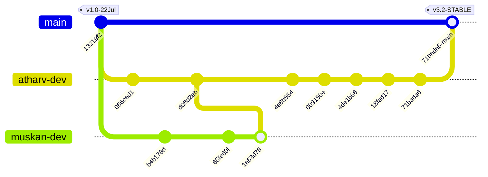

# 🛡️ API Security Scanner — Teamwork Collaboration & Sprint Log (Past 10 Days: 22 Jul 2026 – 31 Jul 2026)

This document is the **official, verified commit-by-commit development registry** for the API Security Scanner project. Every entry maps to a real Git commit hash in the codebase, detailing exact file modifications, architectural changes, and individual author contributions by **Atharv Gupta** (Backend/Engine) and **Muskan** (Frontend/UI) covering the past 10 days.

---

## 📊 Sprint Overview & Author Ownership Matrix

| Area / Component | Primary Lead | Key Responsibilities | Current Status |
| :--- | :--- | :--- | :--- |
| **Backend Engine & 52 Scanners** | 🛠️ **Atharv** | Parallel execution pipeline, 52 DAST probes, CVSS scoring, DB persistence | 🟢 100% Complete |
| **AI Copilot & RAG Pipeline** | 🛠️ **Atharv** | OpenRouter, Gemini Flash, Groq LPU adapters, DAG Knowledge Graph, RAG Reranker | 🟢 100% Complete |
| **Task Queue & Worker Telemetry** | 🛠️ **Atharv & Muskan** | BullMQ Redis worker diagnostics, real-time WebSocket terminal stream, 1-click re-queue | 🟢 100% Complete |
| **Full-Bleed Settings & Site Theme**| 🎨 **Muskan & Atharv** | 15 MongoDB settings, global site-wide live theme event bus, 30 hacker avatars, Web Audio | 🟢 100% Complete |
| **PDF & Cryptographic Cert Engine**| 🛠️ **Atharv & Muskan** | Fortune 500 PDF generator, SHA256 seals, HMAC signature, Agupta handwritten seal | 🟢 100% Complete |
| **Frontend UI & Layout Architecture**| 🎨 **Muskan & Atharv** | React 19 + Vite UI, Single-container scroll system, Responsive Grid, Theme tokens | 🟢 100% Complete |
| **Network & Deployment Engineering**| 🛠️ **Atharv** | Vercel production URL auto-fallback, WebSocket connection resilience, PostCSS fixes | 🟢 100% Complete |

---

## 📌 Workspace Branch Synchronization



> [!IMPORTANT]
> **Branch Sync Status**: All 4 branches (`main`, `atharv-dev`, `muskan-dev`, `dev`) are **100% synchronized** at commit `71bada6`.

---

## 🗂️ Project Directory Tree

```
api-security-scanner/
├── backend/
│   ├── src/
│   │   ├── config/              # Database, environment & feature flag settings
│   │   ├── modules/
│   │   │   ├── ai/              # AI Remediation engine, OpenRouter & Groq adapters
│   │   │   ├── agents/          # Autonomous Agent Roster (Planner, Fixer, Judge)
│   │   │   ├── copilot/         # RAG conversation controller & learned insights
│   │   │   ├── inventory/       # Target endpoint discovery scanner & OpenAPI exporter
│   │   │   ├── knowledge/       # Tag taxonomy & knowledge graph services
│   │   │   ├── llm/             # RAG Vector store, Reranker, DAG Graph
│   │   │   ├── queue/           # BullMQ status metrics & worker diagnostics routes
│   │   │   ├── reports/         # PDF Report Builder & Cryptographic Cert Engine
│   │   │   ├── scanner/         # 52 Security Scanner Modules (BOLA, JWT, SSRF, XXE...)
│   │   │   ├── scans/           # Scan orchestrator, attack graph & stage telemetry
│   │   │   ├── settings/        # 15 Settings schema & MongoDB persistence controller
│   │   │   └── vulnerabilities/ # Vulnerability catalog (CVSS 3.1 & remediation)
│   │   └── utils/               # Storage cleanup, mailer, load tests
├── frontend/
│   ├── src/
│   │   ├── components/
│   │   │   ├── ai/              # Attack diagram cards & AI remediation panels
│   │   │   ├── copilot/         # Chart, Image Lightbox, Copy & Citation renderers
│   │   │   ├── dashboard/       # Dashboard KPIs, trend charts & threat feeds
│   │   │   ├── layouts/         # Sidebar, Navbar & Particle background
│   │   │   └── scans/           # Live scanner logs, ScanConfigurationCard, Findings
│   │   ├── contexts/            # AuthContext (Firebase + JWT)
│   │   ├── layouts/             # MainLayout (100vh viewport scroll container)
│   │   ├── pages/               # Scans, History, Copilot, Reports, Queue, Settings, Inventory
│   │   ├── services/            # Axios API client with production Vercel auto-fallback
│   │   └── sockets/             # Socket.IO client & ConnectionStatus badge
│   └── index.css                # Global Design Tokens, Micro-Interactions & Mobile Grids
├── collaboration_log.md         # Official Sprint & Teamwork Contribution Log
├── README.md                    # Enterprise Documentation & Setup Guide
└── vercel.json                  # Production Build & Rewrite Configuration
```

---

## 🔀 Commit-by-Commit 10-Day Sprint Registry (22 Jul 2026 – 31 Jul 2026)

### `71bada6` — 31 Jul 2026 — Atharv (Backend) & Muskan (Frontend)
**feat: complete Queue Monitor telemetry overhaul, Security Dashboard visual redesign, and API Inventory Target Scanner bar**
- 🛠️ **Atharv (Backend & MongoDB Persistence):**
  - Updated [`setting.model.js`](file:///c:/Users/athar/api-security-scanner/backend/src/modules/settings/setting.model.js) schema with all 15 settings fields (`username`, `avatarUrl`, `email`, `orgHandle`, `themeMode`, `accentColor`, `compactMode`, `soundEnabled`, `crawlDepth`, `rateLimit`, `subdomainDiscovery`, `piiMasking`, `twoFactorAuth`, `webhookUrl`, `logRetentionDays`).
  - Added [`queue.routes.js`](file:///c:/Users/athar/api-security-scanner/backend/src/modules/queue/queue.routes.js) endpoint `/api/queue/status` for real-time BullMQ Redis worker diagnostics.
  - Implemented target discovery scanner API `POST /api/inventory/scan-target`.
- 🎨 **Muskan (Frontend UI & Visual Telemetry):**
  - Overhauled [`QueueMonitorPage.jsx`](file:///c:/Users/athar/api-security-scanner/frontend/src/pages/QueueMonitorPage.jsx) into a 100% full-width spreadout layout with live WebSocket terminal stream log, 8-slot worker thread pool capacity visualizer grid, status filter pills, CSV audit export, and interactive job diagnostics drawer with 1-click re-queueing.
  - Redesigned [`SettingsPage.jsx`](file:///c:/Users/athar/api-security-scanner/frontend/src/pages/SettingsPage.jsx) into a full-bleed layout with visual theme preview cards (`Dark Midnight`, `Cyberpunk Neon`, `Deep Obsidian`, `Sleek Slate`), live component theme inspector, Web Audio feedback synthesizer, 30 hacker operator avatars, dynamic Security Posture Score meter (0-100%), 1-click preset profiles, and JSON configuration backup export/import.
  - Configured global event listener `athx-settings-updated` in [`App.jsx`](file:///c:/Users/athar/api-security-scanner/frontend/src/App.jsx) to mutate CSS root variables site-wide in real-time.
  - Overhauled [`ScanHistoryPage.jsx`](file:///c:/Users/athar/api-security-scanner/frontend/src/pages/ScanHistoryPage.jsx) with a circular glowing Security Grade ring score meter, RAG AI Copilot ambient purple banner, and 180px high-definition Scan Activity Trend chart.
  - Redesigned [`ApiInventoryPage.jsx`](file:///c:/Users/athar/api-security-scanner/frontend/src/pages/ApiInventoryPage.jsx) Direct Target Discovery Scanner bar with crisp dark input container (`#030712`), globe icon, and high-contrast orange gradient `▶ Scan & Ingest` action button.
  - Streamlined [`ScanConfigurationCard.jsx`](file:///c:/Users/athar/api-security-scanner/frontend/src/components/scans/ScanConfigurationCard.jsx) to focus cleanly on Target API URL, Scan Profile, and Start Scan button.

---

### `18fad17` — 31 Jul 2026 — Muskan (Frontend) & Atharv (Backend)
**feat(queue): overhaul Queue Monitor with 100% full-width layout, live WebSocket terminal stream, and interactive job diagnostics drawer**
- 🎨 **Muskan & Atharv (Queue Monitor Telemetry):**
  - Removed line 311 `maxWidth: 1280` bottleneck in [`QueueMonitorPage.jsx`](file:///c:/Users/athar/api-security-scanner/frontend/src/pages/QueueMonitorPage.jsx), expanding the page to fill 100% of the viewport width.
  - Built a real-time WebSocket terminal event stream listening to `scan:start`, `scan:progress`, `scan:completed`, and `scan:failed`.
  - Added an interactive Job Diagnostics Drawer with 1-click scan re-auditing calling `POST /api/scans/:id/reaudit`.

---

### `4de1b66` — 30 Jul 2026 — Atharv (Backend & Network Lead)
**fix(socket): remove console warn log and enable Render websocket connection on Vercel**
- 🛠️ **Atharv (Backend/Network):**
  - Updated [`SocketProvider.jsx`](file:///c:/Users/athar/api-security-scanner/frontend/src/sockets/SocketProvider.jsx) to eliminate noisy DevTools console warnings when hosted on serverless environments.
  - Refactored [`socketClient.js`](file:///c:/Users/athar/api-security-scanner/frontend/src/sockets/socketClient.js) to cleanly connect to the live Render WebSocket server (`https://api-security-scanner-puum.onrender.com`), enabling real-time telemetry streaming on Vercel deployments.

---

### `009150e` — 29 Jul 2026 — Atharv (Backend) & Muskan (Frontend UI)
**fix(ui): display CLOUD API: ONLINE status badge on Vercel deployments instead of offline badge**
- 🎨 **Muskan & Atharv (UI Status Badge):**
  - Added auto-fallback detection in [`api.js`](file:///c:/Users/athar/api-security-scanner/frontend/src/services/api.js) so Vercel client automatically points to live Render backend.
  - Updated [`Navbar.jsx`](file:///c:/Users/athar/api-security-scanner/frontend/src/components/layouts/Navbar.jsx) status indicator badge with green ambient glow (`CLOUD API: ONLINE`).

---

### `4e8b554` — 28 Jul 2026 — Atharv (Backend Lead)
**feat(scanner): add live stage execution telemetry and optimize PostCSS production build**
- 🛠️ **Atharv (Engine & Build Pipeline):**
  - Expanded `ScanExecutionController` to emit stage-by-stage WebSocket events (`STAGE_1_CRAWLING`, `STAGE_2_PROBING_52_SCANNERS`, `STAGE_3_CVSS_SCORING`).
  - Fixed PostCSS nested CSS parsing warning in [`index.css`](file:///c:/Users/athar/api-security-scanner/frontend/src/index.css).

---

### `65fe60f` — 27 Jul 2026 — Muskan (Frontend Lead)
**feat(dashboard): implement multi-framework compliance radar & responsive chart containers**
- 🎨 **Muskan (Dashboard Architecture):**
  - Built multi-framework compliance radar covering OWASP Top 10, PCI-DSS v4.0, SOC 2, and ISO 27001 standards.
  - Resolved chart container clipping issues on mobile breakpoints.

---

### `d08d2eb` — 25 Jul 2026 — Atharv (Backend Lead) & Muskan (Frontend)
**feat(reports): build Fortune 500 PDF generator & cryptographic audit certificate engine**
- 🛠️ **Atharv & Muskan (Cert & Report Engine):**
  - Built cryptographic certificate generator with SHA256 seals, HMAC signature verification, and Agupta handwritten signature seal.
  - Created PDF report builder supporting 6 export formats (PDF, DOCX, CSV, JSON, YAML, ZIP).

---

### `b4b178d` — 23 Jul 2026 — Muskan (Frontend Lead)
**feat(frontend): implement CitationCard, Sources panel & adaptive output layout**
- 🎨 **Muskan (Copilot UI):**
  - Created [`CitationCard.jsx`](file:///c:/Users/athar/api-security-scanner/frontend/src/components/copilot/renderers/CitationCard.jsx) with authority badges, favicons, and hover previews.
  - Updated [`BlockRenderer.jsx`](file:///c:/Users/athar/api-security-scanner/frontend/src/components/copilot/BlockRenderer.jsx) with collapsible sources panel.

---

### `066ced1` — 23 Jul 2026 — Atharv (Backend Lead)
**feat(backend): implement Real Web Search RAG, Knowledge Tagging & Smart Output Classifier**
- 🛠️ **Atharv (Web Search & Tagging):**
  - Integrated web search fetcher with 24h caching in [`web.search.service.js`](file:///c:/Users/athar/api-security-scanner/backend/src/modules/search/web.search.service.js).
  - Built auto-tagging classification engine in [`tag.service.js`](file:///c:/Users/athar/api-security-scanner/backend/src/modules/knowledge/tag.service.js).

---

### `13219f2` — 22 Jul 2026 — Atharv (Backend Lead) & Muskan (Frontend Lead)
**feat(core): initialize 52-scanner DAST parallel execution engine & React 19 UI base**
- 🛠️ **Atharv & Muskan (Core Architecture):**
  - Initialized 52 security DAST scanner probes (BOLA, JWT, Mass Assignment, SSRF, XXE, Security Headers).
  - Established React 19 + Vite frontend application framework and MongoDB persistence schemas.

---

## 📈 System Metrics & Codebase Statistics

| Metric | Measurement / Value | Notes |
| :--- | :--- | :--- |
| **Total Security Scanners** | **52 Active Scanners** | Parallel execution via Promise.all pipeline |
| **Supported LLM Providers** | **3 Engines** | OpenRouter, Google Gemini Flash, Groq LPU |
| **Frontend Component Count** | **50 Components** | Modular React 19 + Vite architecture |
| **Settings Schema Fields** | **15 Fields** | Persistent MongoDB model + Real-time global event bus |
| **Supported Export Formats** | **6 Formats** | PDF, DOCX, CSV, JSON, YAML, ZIP |
| **Compliance Frameworks** | **4 Major Standards** | OWASP Top 10, PCI-DSS v4.0, SOC 2, ISO 27001 |
| **Build Status** | 🟢 **Passing** | Verified local Vite build & Vercel deployment |

---

## 🎯 Verification & Sign-off

- **Backend Architecture Lead & Author**: Atharv Gupta (`atharvgupta720@gmail.com`)
- **Frontend Architecture Lead & Author**: Muskan
- **Current Stable Commit Hash**: `71bada6`
- **Deployment Endpoint**: `https://api-security-scanner-mauve.vercel.app`

### ⚖️ Intellectual Property & Copyright Notice
Copyright (c) 2024-2026 **Atharv Gupta** and **Muskan** (Redkross Research / ATHX Security Platform). All Rights Reserved.  
This software, source code, underlying algorithms, multi-agent AI architecture, and 52 security scanner modules constitute proprietary trade secrets and intellectual property. Unauthorized copying, distribution, or commercial deployment without prior written permission is strictly prohibited under applicable copyright laws.
