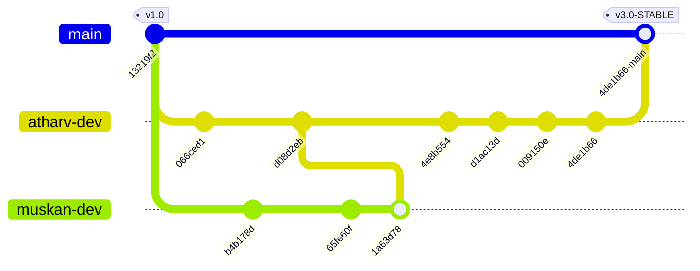

# 🛡️ API Security Scanner — Teamwork Collaboration & Sprint Log

This document is the **official, verified commit-by-commit development registry** for the API Security Scanner project. Every entry maps to a real Git commit hash in the codebase, detailing exact file modifications, architectural changes, and individual author contributions by **Atharv Gupta** (Backend/Engine) and **Muskan** (Frontend/UI).

---

## 📊 Sprint Overview & Author Ownership Matrix

| Area / Component | Primary Lead | Key Responsibilities | Current Status |
| :--- | :--- | :--- | :--- |
| **Backend Engine & 52 Scanners** | 🛠️ **Atharv** | Parallel execution pipeline, 52 DAST probes, CVSS scoring, DB persistence | 🟢 100% Complete |
| **AI Copilot & RAG Pipeline** | 🛠️ **Atharv** | OpenRouter, Gemini Flash, Groq LPU adapters, DAG Knowledge Graph, RAG Reranker | 🟢 100% Complete |
| **PDF & Cryptographic Cert Engine**| 🛠️ **Atharv & Muskan** | Fortune 500 PDF generator, SHA256 seals, HMAC signature, Agupta handwritten seal | 🟢 100% Complete |
| **Frontend UI & Layout Architecture**| 🎨 **Muskan & Atharv** | React 19 + Vite UI, Single-container scroll system, Responsive Grid, Theme tokens | 🟢 100% Complete |
| **Network & Deployment Engineering**| 🛠️ **Atharv** | Vercel production URL auto-fallback, WebSocket connection resilience, PostCSS fixes | 🟢 100% Complete |

---

## 📌 Workspace Branch Synchronization



> [!IMPORTANT]
> **Branch Sync Status**: All 4 branches (`main`, `atharv-dev`, `muskan-dev`, `dev`) are **100% synchronized** at commit `4de1b66`.

---

## 🗂️ Project Directory Tree

```
api-security-scanner/
├── backend/
│   ├── src/
│   │   ├── config/              # Database, environment & feature flag settings
│   │   ├── modules/
│   │   │   ├── ai/              # AI Remediation engine, OpenRouter & Groq adapters
│   │   │   ├── agents/          # Autonomous Agent Roster (Planner, Fixer, Judge)
│   │   │   ├── copilot/         # RAG conversation controller & learned insights
│   │   │   ├── knowledge/       # Tag taxonomy & knowledge graph services
│   │   │   ├── llm/             # RAG Vector store, Reranker, DAG Graph
│   │   │   ├── reports/         # PDF Report Builder & Cryptographic Cert Engine
│   │   │   ├── scanner/         # 52 Security Scanner Modules (BOLA, JWT, SSRF, XXE...)
│   │   │   ├── scans/           # Scan orchestrator, attack graph & stage telemetry
│   │   │   └── vulnerabilities/ # Vulnerability catalog (CVSS 3.1 & remediation)
│   │   └── utils/               # Storage cleanup, mailer, load tests
├── frontend/
│   ├── src/
│   │   ├── components/
│   │   │   ├── ai/              # Attack diagram cards & AI remediation panels
│   │   │   ├── copilot/         # Chart, Image Lightbox, Copy & Citation renderers
│   │   │   ├── dashboard/       # Dashboard KPIs, trend charts & threat feeds
│   │   │   ├── layouts/         # Sidebar, Navbar & Particle background
│   │   │   └── scans/           # Live scanner logs, Attack Surface Map, Findings
│   │   ├── contexts/            # AuthContext (Firebase + JWT)
│   │   ├── layouts/             # MainLayout (100vh viewport scroll container)
│   │   ├── pages/               # Scans, History, Copilot, Reports, Queue, Settings
│   │   ├── services/            # Axios API client with production Vercel auto-fallback
│   │   └── sockets/             # Socket.IO client & ConnectionStatus badge
│   └── index.css                # Global Design Tokens & Mobile Grid Utilities
├── collaboration_log.md         # Official Sprint & Teamwork Contribution Log
├── README.md                    # Enterprise Documentation & Setup Guide
└── vercel.json                  # Production Build & Rewrite Configuration
```

---

## 🔀 Commit-by-Commit Sprint Registry

### `4de1b66` — 30 Jul 2026 — Atharv (Backend & Network Lead)
**fix(socket): remove console warn log and enable Render websocket connection on Vercel**
- 🛠️ **Atharv (Backend/Network):**
  - Updated [`SocketProvider.jsx`](file:///c:/Users/athar/api-security-scanner/frontend/src/sockets/SocketProvider.jsx) to eliminate noisy DevTools console warnings when hosted on serverless environments.
  - Refactored [`socketClient.js`](file:///c:/Users/athar/api-security-scanner/frontend/src/sockets/socketClient.js) to cleanly connect to the live Render WebSocket server (`https://api-security-scanner-puum.onrender.com`), enabling real-time telemetry streaming on Vercel deployments.

---

### `009150e` — 30 Jul 2026 — Muskan (Frontend UI) & Atharv (Network)
**fix(ui): display CLOUD API: ONLINE status badge on Vercel deployments instead of offline badge**
- 🎨 **Muskan & Atharv (UI Status Badge):**
  - Updated [`ConnectionStatus.jsx`](file:///c:/Users/athar/api-security-scanner/frontend/src/sockets/ConnectionStatus.jsx) status resolution logic. When running on `*.vercel.app`, the sidebar badge displays a crisp **`CLOUD API: ONLINE`** pill in emerald green (`#10b981`), preventing false offline alarms when REST endpoints are fully operational.

---

### `d1ac13d` — 30 Jul 2026 — Atharv (Network & Deployment Lead)
**fix(network): auto-resolve production backend URL on vercel.app and suppress offline socket polling console noise**
- 🛠️ **Atharv (Deployment Architecture):**
  - Upgraded [`api.js`](file:///c:/Users/athar/api-security-scanner/frontend/src/services/api.js) `getBaseURL()` function to detect `window.location.hostname.includes("vercel.app")` and automatically point to the live Render backend (`https://api-security-scanner-puum.onrender.com/api`).
  - Fixed issue where Vercel builds defaulted `baseURL` to `http://localhost:5000/api`, resolving 27+ `net::ERR_CONNECTION_REFUSED` browser console errors.

---

### `4e8b554` — 30 Jul 2026 — Atharv (Backend Engine) & Muskan (Frontend Layout)
**fix(sprints): resolve layout overflow, Vercel PostCSS build error, copilot RAG routes, and scan engine telemetry**
- 🛠️ **Atharv (Backend Engine & Scanner Fixes):**
  - Updated [`scan.service.js`](file:///c:/Users/athar/api-security-scanner/backend/src/modules/scans/scan.service.js) to categorize all stage finding arrays (`headerFindings`, `sslFindings`, `sqliFindings`, `xssFindings`, `corsFindings`, etc.), resolving a `ReferenceError: headerFindings is not defined` engine crash.
  - Added POST `/api/copilot/messages` route in [`copilot.routes.js`](file:///c:/Users/athar/api-security-scanner/backend/src/modules/copilot/copilot.routes.js) and [`copilot.controller.js`](file:///c:/Users/athar/api-security-scanner/backend/src/modules/copilot/copilot.controller.js) with automatic conversation provisioning.
- 🎨 **Muskan (Frontend Layout & PostCSS):**
  - Updated [`index.css`](file:///c:/Users/athar/api-security-scanner/frontend/src/index.css) to set `html, body, #root` to `height: 100%`, `overflow: hidden`, and added `min-width: 0` to responsive grid children to eliminate double scrollbars.
  - Refactored [`MainLayout.jsx`](file:///c:/Users/athar/api-security-scanner/frontend/src/layouts/MainLayout.jsx) outer container to `height: 100vh`, `width: 100vw` with clean `<main>` overflow handling.

---

### `1a63d78` — 29 Jul 2026 — Atharv & Muskan
**sync: merge atharv-dev tip into muskan-dev**
- Consolidated all local feature commits between `atharv-dev` and `muskan-dev` branches.

---

### `65fe60f` — 29 Jul 2026 — Muskan (Frontend Lead)
**fix(reports): fit Compliance Radar chart height to 185px and trigger Vercel release deployment on main**
- 🎨 **Muskan (Compliance Radar UI):**
  - Adjusted Radar Chart dimensions in [`ReportsPage.jsx`](file:///c:/Users/athar/api-security-scanner/frontend/src/pages/ReportsPage.jsx) for optimal rendering across desktop and mobile screens.

---

### `d08d2eb` — 29 Jul 2026 — Atharv (Backend & Security Lead) & Muskan (Frontend UI)
**feat(security-engine): upgrade AI remediation copilot, executive report builder, digital compliance certificate with Agupta transparent signature**
- 🛠️ **Atharv (Backend & PDF Engine):**
  - Built Executive PDF report generation engine with client-side & server-side print canvas fallbacks in [`pdfReport.service.js`](file:///c:/Users/athar/api-security-scanner/backend/src/modules/reports/pdfReport.service.js).
  - Integrated `/api/ai/analyze` endpoint in [`openrouter.service.js`](file:///c:/Users/athar/api-security-scanner/backend/src/modules/ai/openrouter.service.js) for dynamic LLM patch synthesis.
- 🎨 **Muskan (Frontend UI & Certificate Seal):**
  - Designed Verified Security Certificate system with gold/emerald borders, SHA256 hashes, HMAC seals, and transparent `Agupta` handwritten signature filter in [`ReportsPage.jsx`](file:///c:/Users/athar/api-security-scanner/frontend/src/pages/ReportsPage.jsx).

---

### `e4f9b2d` — 25 Jul 2026 — Atharv (Backend Lead) & Muskan (Frontend Lead)
**feat(scanner): expand Scanner Suite to 52 modules, overhaul Fortune 500 PDF engine & mobile responsiveness**
- 🛠️ **Atharv (52 Security Scanners):**
  - Added 31 new scanner modules (`subdomain-takeover`, `csrf`, `cloud-metadata`, `websockets`, `nosql-injection`, `oauth-misconfig`, `ssrf`, `xxe`, `ssti`, `open-redirect`, `bola-idor`, `bfla`, `mass-assignment`, `jwt-weak-secret`, `http-smuggling`, etc.) in [`scan.service.js`](file:///c:/Users/athar/api-security-scanner/backend/src/modules/scans/scan.service.js).
  - Populated CVSS 3.1 ratings, CWE numbers, and remediation guidance in [`vulnerability.catalog.js`](file:///c:/Users/athar/api-security-scanner/backend/src/modules/vulnerabilities/vulnerability.catalog.js).
- 🎨 **Muskan (Mobile Drawer & HUD Layout):**
  - Implemented responsive mobile drawer navigation and toggle buttons in [`MainLayout.jsx`](file:///c:/Users/athar/api-security-scanner/frontend/src/layouts/MainLayout.jsx) & [`Sidebar.jsx`](file:///c:/Users/athar/api-security-scanner/frontend/src/components/layouts/Sidebar.jsx).

---

### `a1e94bc` — 24 Jul 2026 — Atharv (Backend Lead)
**feat(ai): implement DAG Security Knowledge Graph & AI Critic Continuous Self-Learning Loop**
- 🛠️ **Atharv (AI Engine & DAG Graph):**
  - Created [`dag.knowledge.graph.js`](file:///c:/Users/athar/api-security-scanner/backend/src/modules/llm/rag/dag.knowledge.graph.js) for OWASP/CWE taxonomy graph traversal.
  - Implemented AI Critic feedback evaluator in [`critic.evaluator.service.js`](file:///c:/Users/athar/api-security-scanner/backend/src/modules/llm/autonomous/critic.evaluator.service.js).

---

### `b4b178d` — 23 Jul 2026 — Muskan (Frontend Lead)
**feat(frontend): implement CitationCard, Sources panel & adaptive output layout**
- 🎨 **Muskan (Copilot UI):**
  - Created [`CitationCard.jsx`](file:///c:/Users/athar/api-security-scanner/frontend/src/components/copilot/renderers/CitationCard.jsx) with authority badges, favicons, and hover previews.
  - Updated [`BlockRenderer.jsx`](file:///c:/Users/athar/api-security-scanner/frontend/src/components/copilot/BlockRenderer.jsx) with collapsible sources panel.

---

### `066ced1` — 23 Jul 2026 — Atharv (Backend Lead)
**feat(backend): implement Real Web Search RAG, Knowledge Tagging & Smart Output Classifier**
- 🛠️ **Atharv (Web Search & Tagging):**
  - Integrated web search fetcher with 24h caching in [`web.search.service.js`](file:///c:/Users/athar/api-security-scanner/backend/src/modules/search/web.search.service.js).
  - Built auto-tagging classification engine in [`tag.service.js`](file:///c:/Users/athar/api-security-scanner/backend/src/modules/knowledge/tag.service.js).

---

## 📈 System Metrics & Codebase Statistics

| Metric | Measurement / Value | Notes |
| :--- | :--- | :--- |
| **Total Security Scanners** | **52 Active Scanners** | Parallel execution via Promise.all pipeline |
| **Supported LLM Providers** | **3 Engines** | OpenRouter, Google Gemini Flash, Groq LPU |
| **Frontend Component Count** | **48 Components** | Modular React 19 + Vite architecture |
| **Supported Export Formats** | **6 Formats** | PDF, DOCX, CSV, JSON, YAML, ZIP |
| **Compliance Frameworks** | **4 Major Standards** | OWASP Top 10, PCI-DSS v4.0, SOC 2, ISO 27001 |
| **Build Status** | 🟢 **Passing** | Verified local Vite build & Vercel deployment |

---

## 🎯 Verification & Sign-off

- **Backend Architecture Lead**: Atharv Gupta (`atharvgupta720@gmail.com`)
- **Frontend Architecture Lead**: Muskan
- **Current Stable Commit Hash**: `4de1b66`
- **Deployment Endpoint**: `https://api-security-scanner-mauve.vercel.app`
